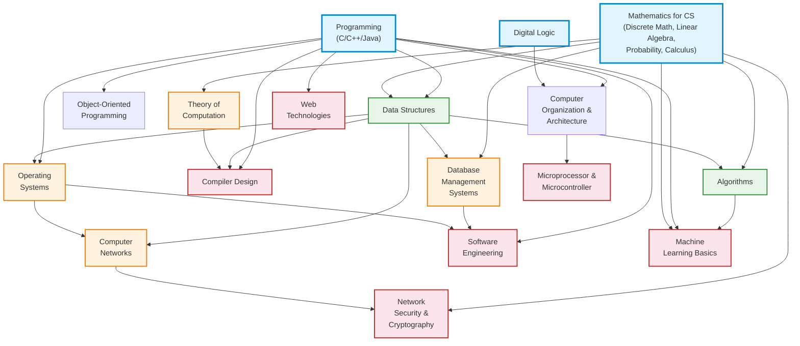
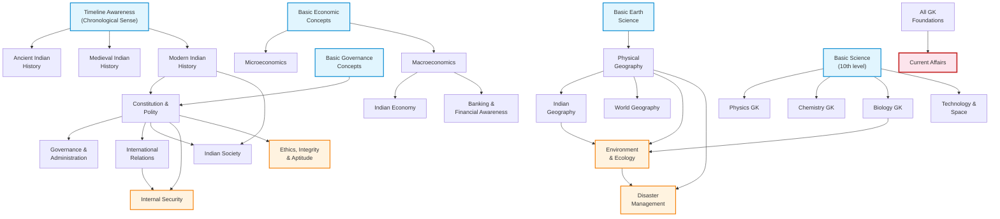
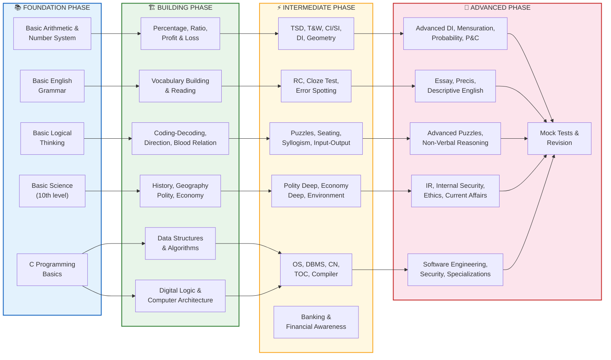

# 🗺️ PART 7: Knowledge Dependency Map & Learning Sequence

> **Purpose**: This document maps every prerequisite, co-requisite, and downstream dependency for every subject and sub-topic tested across Indian Government Examinations. Use it to design a study plan that never forces you to learn Topic B before you have mastered Topic A.

> **Who Is This For**: A Computer Engineering graduate eligible for both Technical roles (ISRO Scientist/Engineer, DRDO STA, SSC JE, RRB JE, NIELIT, BEL, ECIL, etc.) and Non-Technical roles (UPSC CSE/CDS/CAPF, SSC CGL/CHSL/MTS, RRB NTPC, Banking PO/Clerk, State PSC, etc.).

---

## Section 1: Subject Dependencies (Text-based Dependency Tree)

### Legend
- `→` means "is a prerequisite for"
- `⟶` means "strongly depends on"
- `||` means "can be studied in parallel"
- `⇄` means "mutually reinforcing (study together)"
- `[F]` = Foundation / Root node (no prerequisite)
- `[T]` = Terminal node (nothing depends on it within the exam scope)
- `[P]` = Parallel-safe (can be studied alongside other marked [P] topics)

---

### 1.1 Quantitative Aptitude / Mathematics Complete Dependency Tree

```
[F] Number System (Basics: Natural, Whole, Integers, Rational, Irrational, Real)
    → Divisibility Rules
        → HCF & LCM
            → Problems on Ages [T]
            → Fractions & Decimals
                → Percentage
                    → Profit, Loss & Discount
                        → Successive Discounts [T]
                        → Marked Price Problems [T]
                        → Partnership
                            → Partnership with Time [T]
                            → Compound Partnership [T]
                    → Simple Interest
                        → Compound Interest
                            → Growth & Depreciation [T]
                            → Population-based Problems [T]
                            → Installments (SI + CI combined) [T]
                    → Ratio & Proportion
                        → Mixture & Alligation
                            → Replacement Problems [T]
                            → Repeated Dilution [T]
                        → Direct & Inverse Proportion
                            → Unitary Method
                                → Time & Work
                                    → Pipes & Cisterns [T]
                                    → Work & Wages [T]
                                    → Efficiency-based Problems [T]
                                    → Alternate Day Work Problems [T]
                                → Time, Speed & Distance
                                    → Relative Speed
                                        → Problems on Trains [T]
                                        → Boats & Streams [T]
                                        → Races & Circular Tracks [T]
                                    → Average Speed [T]
                                    → Meeting Point Problems [T]
                    → Data Interpretation (DI)
                        → Bar Graph Interpretation [T]
                        → Pie Chart Interpretation [T]
                        → Line Graph Interpretation [T]
                        → Table-based DI [T]
                        → Mixed/Caselet DI [T]
                        → Radar/Web Chart DI [T]
                        → Missing DI [T]
    → Squares, Cubes & Roots
        → Surds & Indices
            → Simplification & Approximation [T]
            → Number Series (Pattern Recognition) [T]
    → Even/Odd, Prime/Composite
        → Remainders & Cyclicity
            → Remainder Theorem [T]
            → Fermat's Little Theorem [T]
            → Wilson's Theorem [T]
            → Chinese Remainder Theorem [T]
        → Factors & Multiples
            → Number of Factors/Divisors [T]
            → Sum of Factors [T]
            → Product of Factors [T]
    → Unit Digit & Last Two Digits [T]

[F] Basic Counting Principles
    → Permutation & Combination
        → Probability
            → Conditional Probability [T]
            → Bayes' Theorem [T]
            → Expected Value [T]
            → Dice, Coins, Cards Problems [T]
        → Arrangement Problems [T]
        → Selection Problems [T]
        → Circular Permutation [T]
        → Derangement [T]

[F] Basic Algebra (Variables, Equations)
    → Linear Equations (1 variable)
        → Linear Equations (2 variables)
            → Linear Equations (3 variables) [T]
            → Word Problems on Linear Equations [T]
    → Quadratic Equations
        → Nature of Roots (Discriminant) [T]
        → Inequality (Quadratic-based)
            → Modulus-based Inequality [T]
            → Range-based Questions [T]
        → Relation between Roots & Coefficients [T]
    → Algebraic Identities
        → Factorization [T]
        → Simplification of Algebraic Expressions [T]
    → Sequences & Series
        → Arithmetic Progression (AP)
            → Sum of n terms of AP [T]
            → Arithmetic Mean [T]
        → Geometric Progression (GP)
            → Sum of n terms of GP [T]
            → Infinite GP [T]
            → Geometric Mean [T]
        → Harmonic Progression (HP) [T]
    → Polynomials
        → Remainder Theorem (Algebra) [T]
        → Factor Theorem [T]

[F] Basic Geometry Concepts (Point, Line, Angle)
    → Properties of Angles (Adjacent, Supplementary, Complementary, Vertically Opposite)
        → Parallel Lines & Transversals
            → Angle Sum Property of Triangles
                → Types of Triangles (Equilateral, Isosceles, Scalene, Right)
                    → Congruence of Triangles (SSS, SAS, ASA, AAS, RHS)
                        → Similarity of Triangles (AA, SAS, SSS)
                            → Basic Proportionality Theorem (BPT) [T]
                            → Mid-Point Theorem [T]
                    → Pythagoras Theorem
                        → Pythagorean Triplets [T]
                        → Distance-based Geometry Problems [T]
                    → Special Triangles (30-60-90, 45-45-90) [T]
                → Exterior Angle Theorem [T]
                → Angle Bisector Theorem [T]
                → Centroid, Orthocentre, Incentre, Circumcentre
                    → Euler's Line [T]
                    → Properties of Special Points [T]
            → Quadrilaterals
                → Parallelogram Properties
                    → Rectangle Properties [T]
                    → Rhombus Properties [T]
                    → Square Properties [T]
                → Trapezium Properties [T]
                → Cyclic Quadrilateral [T]
        → Circles
            → Chord Properties
                → Equal Chords & Distance from Centre [T]
                → Intersecting Chords Theorem [T]
            → Tangent Properties
                → Tangent from External Point [T]
                → Direct & Transverse Common Tangents [T]
            → Arc, Sector & Segment
                → Angle subtended by Arc [T]
                → Inscribed Angle Theorem [T]
            → Concentric Circles [T]

[F] Mensuration Foundations (requires Geometry + Arithmetic)
    → Perimeter & Area of 2D Shapes
        → Area of Triangle (Base×Height, Heron's)
            → Area of Equilateral Triangle [T]
            → Area of Isosceles Triangle [T]
        → Area of Quadrilaterals (Square, Rectangle, Parallelogram, Rhombus, Trapezium) [T]
        → Area of Circle, Semicircle, Quadrant
            → Area of Sector & Segment [T]
            → Area of Ring (Annulus) [T]
        → Area of Irregular Shapes (Composite Figures) [T]
        → Perimeter of Composite Shapes [T]
    → Surface Area & Volume of 3D Shapes
        → Cube & Cuboid
            → Longest Diagonal [T]
            → Painting/Cutting Problems [T]
        → Cylinder
            → Hollow Cylinder [T]
        → Cone
            → Frustum of Cone [T]
        → Sphere & Hemisphere [T]
        → Prism [T]
        → Pyramid [T]
        → Combined Solids (e.g., Cone on Cylinder) [T]
        → Volume & Surface Area when shapes are melted/recast [T]

[F] Trigonometry Basics (requires Basic Geometry)
    → Trigonometric Ratios (sin, cos, tan, cot, sec, cosec)
        → Trigonometric Identities
            → Simplification using Identities [T]
            → Proving Identities [T]
        → Values at Standard Angles (0°, 30°, 45°, 60°, 90°)
            → Height & Distance
                → Single Triangle Problems [T]
                → Two Triangle Problems [T]
                → Problems involving Elevation & Depression [T]
        → Complementary Angle Relations [T]
        → Maximum & Minimum Value Problems [T]

[F] Coordinate Geometry (requires Basic Algebra + Basic Geometry)
    → Distance Formula [T]
    → Section Formula (Internal & External Division) [T]
    → Area of Triangle using Coordinates [T]
    → Equation of a Line (Slope-Intercept, Two-Point, Point-Slope)
        → Parallel & Perpendicular Lines (using Slopes) [T]
        → Distance of a Point from a Line [T]
        → Intersection of Two Lines [T]
    → Equation of Circle [T]

[F] Statistics (requires Arithmetic Basics)
    → Mean (Arithmetic, Weighted)
        → Combined Mean [T]
    → Median
        → Median for Grouped Data [T]
    → Mode
        → Mode for Grouped Data [T]
    → Range [T]
    → Standard Deviation & Variance
        → Coefficient of Variation [T]
    → Frequency Distribution
        → Cumulative Frequency [T]
        → Ogive Curve [T]
    → Quartiles, Deciles, Percentiles [T]

[F] Set Theory (requires Basic Counting)
    → Union, Intersection, Complement
        → Venn Diagrams (2-set, 3-set problems)
            → Maximum/Minimum type Venn Diagram Problems [T]
            → Word Problems using Venn Diagrams [T]
```

---

### 1.2 Reasoning (Verbal & Non-Verbal) Complete Dependency Tree

```
=== VERBAL / LOGICAL REASONING ===

[F] Basic Logical Thinking (Innate)
    → Analogy (Word-based)
        → Letter Analogy [T]
        → Number Analogy [T]
        → Meaningful Word Analogy [T]
    → Classification (Odd One Out)
        → Word Classification [T]
        → Letter Classification [T]
        → Number Classification [T]
    → Series Completion
        → Number Series (Reasoning-based) [T]
        → Alphabet Series [T]
        → Alpha-Numeric Series [T]
        → Mixed Series [T]
        → Wrong Number in Series [T]
        → Missing Number in Series [T]

[F] Alphabet & Number Awareness
    → Alphabet Position & Ranking
        → Coding-Decoding (Letter Shifting)
            → New Pattern Coding-Decoding [T]
            → Condition-based Coding [T]
            → Coding in Fictitious Language [T]
            → Coding-Decoding with Symbols [T]
        → Word Formation [T]
        → Arranging Words in Dictionary Order [T]
        → Arranging Words in Meaningful Sequence [T]

[F] Basic Spatial Awareness
    → Direction Sense
        → Shadow-based Direction Problems [T]
        → Shortest Distance Problems [T]
        → Displacement-based Problems [T]
    → Blood Relations
        → Coded Blood Relations [T]
        → Family Tree Problems [T]
        → Mixed Blood Relation + Direction [T]
    → Ranking & Order
        → Linear Arrangement
            → Single Row (Facing North/South) [T]
            → Double Row (Facing Each Other) [T]
            → Multiple Row Arrangements [T]
        → Circular Arrangement
            → Circular Seating (Facing Centre) [T]
            → Circular Seating (Facing Outward) [T]
            → Circular Seating (Mixed Facing) [T]
        → Square/Rectangular Arrangement [T]
        → Polygon-based Arrangement [T]
    → Floor/Building-based Puzzles
        → Single Variable Floor Puzzle [T]
        → Multi-Variable Floor Puzzle [T]
        → Floor + Direction Combined [T]
    → Scheduling/Day-based Puzzles [T]
    → Box-based Puzzles [T]
    → Comparison-based Puzzles [T]

[F] Propositional Logic (Basic Understanding of Statements)
    → Syllogism (Classical)
        → Possibility-based Syllogism [T]
        → Coded Syllogism [T]
        → Reverse Syllogism [T]
    → Statement & Conclusion [T]
    → Statement & Assumption [T]
    → Statement & Course of Action [T]
    → Statement & Argument (Strong/Weak) [T]
    → Cause & Effect [T]
    → Assertion & Reason [T]

[F] Mathematical Reasoning Foundations
    → Inequality (Reasoning-based)
        → Coded Inequality [T]
        → Direct Inequality [T]
        → Quantity Comparison (I vs II) [T]
    → Data Sufficiency
        → Statement alone sufficient [T]
        → Both statements needed [T]
        → Neither sufficient [T]
    → Input-Output
        → Number-based Input-Output [T]
        → Word-based Input-Output [T]
        → Mixed Input-Output [T]
    → Mathematical Operations (Symbol Substitution)
        → BODMAS with Symbols [T]
        → Equation Balancing [T]

=== NON-VERBAL REASONING ===

[F] Visual-Spatial Intelligence (Innate)
    → Pattern Recognition (Visual)
        → Figure Series Completion [T]
        → Figure Analogy [T]
        → Figure Classification [T]
    → Mirror Image [T]
    → Water Image [T]
    → Paper Folding & Cutting
        → Hole Punching [T]
        → Paper Folding Prediction [T]
    → Embedded Figures [T]
    → Completion of Incomplete Figures [T]
    → Counting Figures (Triangles, Squares, Lines)
        → Counting Triangles [T]
        → Counting Squares/Rectangles [T]
        → Counting Straight Lines [T]
    → Cube & Dice
        → Dice (Standard Dice Rules) [T]
        → Unfolded Cube to Folded Cube [T]
        → Painted Cube Problems [T]
    → Dot Situation [T]
    → Grouping of Identical Figures [T]
    → Formation of Figures from given pieces [T]
```

---

### 1.3 English Language Complete Dependency Tree

```
[F] Basic English Grammar (Parts of Speech)
    → Nouns (Types, Countable/Uncountable)
        → Articles (a, an, the)
            → Article-based Error Spotting [T]
        → Subject-Verb Agreement
            → Error Spotting (SVA-based) [T]
    → Pronouns (Types, Cases)
        → Pronoun-Antecedent Agreement [T]
        → Pronoun-based Errors [T]
    → Verbs (Main, Auxiliary, Modal)
        → Tenses (Present, Past, Future — Simple, Continuous, Perfect, Perfect Continuous)
            → Tense Consistency in Paragraphs [T]
            → Sequence of Tenses [T]
            → Error Spotting (Tense-based) [T]
        → Active & Passive Voice
            → Voice Conversion [T]
            → Voice-based Error Spotting [T]
        → Direct & Indirect Speech (Narration)
            → Narration Change [T]
            → Narration-based Error Spotting [T]
        → Subject-Verb Agreement (Advanced)
            → Collective Nouns Agreement [T]
            → Indefinite Pronouns Agreement [T]
            → Compound Subjects Agreement [T]
    → Adjectives (Types, Degrees of Comparison)
        → Comparative & Superlative Errors [T]
    → Adverbs (Types, Position)
        → Adverb Placement Errors [T]
    → Prepositions
        → Preposition Usage Errors [T]
        → Prepositional Phrases [T]
    → Conjunctions (Coordinating, Subordinating, Correlative)
        → Conjunction-based Errors [T]
        → Parallelism [T]

[F] Vocabulary Building (Ongoing, Parallel-safe)
    → Synonyms [T] [P]
    → Antonyms [T] [P]
    → One Word Substitution [T] [P]
    → Idioms & Phrases [T] [P]
    → Spelling Correction [T] [P]
    → Foreign Words Used in English [T] [P]
    → Homonyms, Homophones, Homographs [T] [P]
    → Word Usage / Word Appropriateness [T] [P]

[F] Sentence Structure Understanding (requires Grammar Basics)
    → Sentence Improvement / Sentence Correction
        → Grammar-based Improvement [T]
        → Vocabulary-based Improvement [T]
    → Sentence Rearrangement (Jumbled Sentences)
        → Para Jumbles (4 sentences) [T]
        → Para Jumbles (5-6 sentences) [T]
    → Fill in the Blanks
        → Single Blank (Grammar-based) [T]
        → Single Blank (Vocabulary-based) [T]
        → Double/Triple Fill in the Blanks [T]
    → Cloze Test
        → New Pattern Cloze Test [T]
        → Error-based Cloze Test [T]
    → Error Spotting / Error Detection
        → Phrase Replacement [T]
        → Sentence-based Error [T]
        → Paragraph-based Error [T]
    → Word Swap / Replacement [T]
    → Column-based Questions (Match columns for correct sentences) [T]
    → Sentence Connectors [T]
    → Starters (Sentence beginning) [T]

[F] Reading Skills (requires Vocabulary + Grammar)
    → Reading Comprehension (RC)
        → Factual/Detail-based Questions [T]
        → Inference-based Questions [T]
        → Vocabulary-in-Context Questions [T]
        → Main Idea / Theme Questions [T]
        → Title-based Questions [T]
        → Tone/Attitude of Author Questions [T]
        → Critical Reasoning within RC [T]
    → Passage-based Summary [T]
    → Passage Completion [T]

[F] Writing Skills (requires Grammar + Vocabulary + Reading)
    → Precis Writing [T]
    → Essay Writing [T]
    → Letter Writing (Formal/Informal) [T]
    → Paragraph Writing [T]
    → Report Writing [T]
    → Comprehension & Summary (Descriptive Paper) [T]
```

---

### 1.4 General Knowledge / General Awareness Complete Dependency Tree

```
=== HISTORY ===

[F] Timeline Awareness (Chronological Sense)
    → Ancient Indian History
        → Indus Valley Civilization [T]
        → Vedic Period (Rig Vedic & Later Vedic) [T]
        → Buddhism & Jainism [T]
        → Mahajanapadas & Rise of Magadha [T]
        → Mauryan Empire (Chandragupta, Ashoka) [T]
        → Post-Mauryan Period (Sungas, Kanvas, Satavahanas, Indo-Greeks, Kushanas) [T]
        → Gupta Empire & Post-Gupta [T]
        → Sangam Age (South India) [T]
        → Harshavardhana [T]
        → South Indian Dynasties (Cholas, Chalukyas, Pallavas, Rashtrakutas, Pandyas, Hoysalas, Kakatiyas) [T]
    → Medieval Indian History
        → Delhi Sultanate (Slave, Khalji, Tughlaq, Sayyid, Lodi)
            → Administration, Economy, Architecture of Sultanate [T]
        → Vijayanagara & Bahmani Kingdoms [T]
        → Bhakti & Sufi Movements [T]
        → Mughal Empire (Babur to Aurangzeb)
            → Mughal Administration [T]
            → Mughal Art, Architecture, Culture [T]
            → Decline of Mughal Empire [T]
        → Maratha Empire (Shivaji, Peshwas) [T]
        → Arrival of Europeans (Portuguese, Dutch, French, English) [T]
    → Modern Indian History
        → Establishment of British Rule
            → Battle of Plassey, Buxar [T]
            → Subsidiary Alliance, Doctrine of Lapse [T]
        → British Administrative Policies & Acts (Regulating Act to Indian Independence Act)
            → Charter Acts [T]
            → Government of India Acts (1858, 1909, 1919, 1935) [T]
        → Socio-Religious Reform Movements
            → Brahmo Samaj, Arya Samaj, Ramakrishna Mission [T]
            → Widow Remarriage, Sati Abolition, Education Reforms [T]
        → Revolt of 1857 [T]
        → Indian National Movement
            → Formation of INC [T]
            → Moderate Phase (Dadabhai Naoroji, Gokhale, etc.) [T]
            → Extremist Phase (Tilak, Lajpat Rai, Bipin Chandra Pal) [T]
            → Revolutionary Movements (Bhagat Singh, Chandrashekhar Azad, etc.) [T]
            → Gandhian Era
                → Non-Cooperation Movement [T]
                → Civil Disobedience Movement [T]
                → Quit India Movement [T]
                → Other Movements (Khilafat, Swadeshi, etc.) [T]
            → Subhash Chandra Bose & INA [T]
            → Communal Politics & Partition [T]
            → Independence & Integration of States [T]
        → Post-Independence India
            → Five Year Plans [T]
            → Integration of Princely States [T]
            → Wars (1962, 1965, 1971, 1999) [T]
            → Emergency (1975) [T]
            → Economic Liberalization (1991) [T]

=== GEOGRAPHY ===

[F] Basic Earth Science Concepts
    → Physical Geography
        → Universe, Solar System, Earth's Origin [T]
        → Earth's Interior Structure [T]
        → Rocks & Minerals [T]
        → Earthquakes & Volcanoes [T]
        → Plate Tectonics & Continental Drift [T]
        → Geomorphology (Landforms by Running Water, Wind, Glaciers, Waves)
            → Fluvial Landforms [T]
            → Aeolian Landforms [T]
            → Glacial Landforms [T]
            → Coastal/Marine Landforms [T]
            → Karst Landforms [T]
        → Atmosphere
            → Composition & Structure of Atmosphere [T]
            → Insolation & Heat Budget [T]
            → Temperature Distribution [T]
            → Atmospheric Pressure & Winds
                → Planetary Winds [T]
                → Local Winds [T]
                → Jet Streams [T]
            → Humidity & Precipitation
                → Types of Rainfall [T]
                → Clouds & Their Types [T]
            → Cyclones (Tropical & Temperate) [T]
            → Climate Classification (Koppen) [T]
        → Hydrosphere
            → Ocean Currents [T]
            → Tides [T]
            → Ocean Floor Topography [T]
            → Salinity & Temperature Distribution [T]
            → Coral Reefs [T]
            → Marine Resources [T]
        → Biogeography
            → Biomes of the World [T]
            → Biodiversity Hotspots [T]
            → Soil Types & Formation [T]
            → Natural Vegetation [T]
    → Indian Geography
        → Physical Features of India
            → Himalayas (Divisions, Passes) [T]
            → Northern Plains [T]
            → Peninsular Plateau [T]
            → Coastal Plains & Islands [T]
            → Indian Desert [T]
        → Drainage System
            → Himalayan Rivers (Indus, Ganga, Brahmaputra systems) [T]
            → Peninsular Rivers (Godavari, Krishna, Narmada, Tapti, etc.) [T]
            → Lakes of India [T]
        → Climate of India
            → Monsoon Mechanism [T]
            → Seasons of India [T]
            → Rainfall Distribution [T]
        → Soils of India [T]
        → Natural Vegetation of India [T]
        → Agriculture
            → Types of Farming [T]
            → Major Crops (Kharif, Rabi, Zaid) [T]
            → Green Revolution, White Revolution, Blue Revolution [T]
            → Agricultural Schemes & Policies [T]
        → Minerals & Energy Resources
            → Metallic Minerals (Iron, Manganese, Bauxite, Copper, etc.) [T]
            → Non-Metallic Minerals (Mica, Limestone, etc.) [T]
            → Conventional Energy (Coal, Petroleum, Natural Gas, Nuclear) [T]
            → Non-Conventional Energy (Solar, Wind, Biomass, Geothermal, Tidal) [T]
        → Industries of India
            → Iron & Steel, Textile, Sugar, Cement, IT, Automobile [T]
            → Industrial Regions & Corridors [T]
        → Transport & Communication [T]
        → Population & Urbanization
            → Census Data [T]
            → Migration [T]
            → Smart Cities [T]
    → World Geography
        → Continents & Oceans [T]
        → Major Mountains, Plateaus, Plains of the World [T]
        → Major Rivers & Lakes of the World [T]
        → Countries, Capitals, Currencies [T]
        → International Boundaries [T]
        → Important Straits, Channels, Passes [T]

=== INDIAN POLITY & CONSTITUTION ===

[F] Basic Concepts of Governance (Democracy, Republic, Sovereignty)
    → Historical Background of Constitution
        → Making of the Constitution
            → Constituent Assembly [T]
            → Preamble [T]
            → Sources of Indian Constitution [T]
    → Fundamental Rights (Articles 12-35)
        → Right to Equality (14-18) [T]
        → Right to Freedom (19-22) [T]
        → Right against Exploitation (23-24) [T]
        → Right to Freedom of Religion (25-28) [T]
        → Cultural & Educational Rights (29-30) [T]
        → Right to Constitutional Remedies (32) [T]
    → Directive Principles of State Policy (36-51) [T]
    → Fundamental Duties (51A) [T]
    → Union Government
        → President (Executive Head)
            → Election, Powers, Ordinance-making [T]
            → Impeachment [T]
        → Vice President [T]
        → Prime Minister & Council of Ministers
            → Collective Responsibility [T]
            → Cabinet Committees [T]
        → Parliament
            → Lok Sabha & Rajya Sabha
                → Composition, Speaker, Deputy Speaker [T]
                → Legislative Procedure (Ordinary Bill, Money Bill, Finance Bill) [T]
                → Parliamentary Privileges [T]
                → Parliamentary Committees [T]
                → Question Hour, Zero Hour, Adjournment Motion, No-Confidence Motion [T]
                → Joint Sitting of Parliament [T]
    → State Government
        → Governor [T]
        → Chief Minister & State Council of Ministers [T]
        → State Legislature (Vidhan Sabha, Vidhan Parishad) [T]
    → Union Territories [T]
    → Judiciary
        → Supreme Court
            → Original, Appellate, Advisory Jurisdiction [T]
            → Judicial Review [T]
            → Public Interest Litigation (PIL) [T]
        → High Courts [T]
        → Subordinate Courts [T]
        → Tribunals (Administrative, Other) [T]
    → Centre-State Relations
        → Legislative Relations [T]
        → Administrative Relations [T]
        → Financial Relations [T]
        → Inter-State Councils [T]
    → Local Government (Panchayati Raj & Municipalities)
        → 73rd Amendment (Panchayats) [T]
        → 74th Amendment (Municipalities) [T]
    → Constitutional Bodies
        → Election Commission [T]
        → UPSC & SPSC [T]
        → Finance Commission [T]
        → CAG (Comptroller & Auditor General) [T]
        → Attorney General & Advocate General [T]
        → National Commissions (SC, ST, OBC, Women, Minorities, etc.) [T]
    → Statutory/Regulatory Bodies
        → NITI Aayog [T]
        → NHRC [T]
        → CIC (Central Information Commission) [T]
        → Lokpal & Lokayukta [T]
        → CBI, NIA, ED [T]
    → Special Provisions
        → Scheduled & Tribal Areas [T]
        → Official Language [T]
        → Emergency Provisions (352, 356, 360) [T]
    → Amendment Procedure [T]
    → Important Constitutional Amendments [T]
    → Important Supreme Court Judgments [T]

=== ECONOMICS ===

[F] Basic Economic Concepts (Scarcity, Choice, Opportunity Cost)
    → Microeconomics Basics
        → Demand & Supply
            → Elasticity of Demand & Supply [T]
            → Market Equilibrium [T]
        → Types of Markets (Perfect Competition, Monopoly, Oligopoly, Monopolistic) [T]
        → Consumer Behavior (Utility, Indifference Curves) [T]
    → Macroeconomics Basics
        → National Income Accounting
            → GDP, GNP, NDP, NNP [T]
            → GDP at Factor Cost vs Market Price [T]
            → Real vs Nominal GDP [T]
            → GDP Deflator [T]
        → Money & Banking
            → Functions of Money [T]
            → Types of Banks (Commercial, Cooperative, Payment, Small Finance) [T]
            → RBI (Functions, Monetary Policy)
                → Repo Rate, Reverse Repo Rate, CRR, SLR, MSF, Bank Rate [T]
                → Open Market Operations [T]
                → Quantitative & Qualitative Tools [T]
            → Money Supply (M0, M1, M2, M3) [T]
            → Credit Creation [T]
            → NBFC [T]
            → Financial Inclusion (Jan Dhan, Mudra, etc.) [T]
        → Inflation
            → Types (Demand-pull, Cost-push) [T]
            → CPI, WPI [T]
            → Deflation, Stagflation, Hyperinflation [T]
            → Inflation Targeting (MPC) [T]
        → Fiscal Policy
            → Government Revenue (Tax & Non-Tax) [T]
            → Government Expenditure (Revenue & Capital) [T]
            → Budget (Types of Deficit — Fiscal, Revenue, Primary) [T]
            → FRBM Act [T]
            → Public Debt [T]
        → External Sector
            → Balance of Payments (Current Account, Capital Account) [T]
            → Exchange Rate (Fixed, Floating, Managed Float) [T]
            → Foreign Exchange Reserves [T]
            → Trade Policy (Import/Export) [T]
            → FDI & FPI [T]
            → WTO, IMF, World Bank [T]
        → Tax System
            → Direct Taxes (Income Tax, Corporate Tax) [T]
            → Indirect Taxes (GST, Customs Duty) [T]
            → Tax Reforms [T]
            → Laffer Curve [T]
    → Indian Economy
        → Economic Planning in India
            → Five Year Plans [T]
            → NITI Aayog [T]
        → Agriculture Sector [T]
        → Industrial Sector
            → Industrial Policy [T]
            → Make in India, PLI Schemes [T]
            → PSUs & Disinvestment [T]
        → Service Sector [T]
        → Poverty & Unemployment
            → Poverty Line & Measurement [T]
            → Employment Schemes (MGNREGA, etc.) [T]
            → Types of Unemployment [T]
        → Inclusive Growth
            → Human Development Index [T]
            → Sustainable Development Goals [T]
            → Social Sector Schemes [T]
        → Infrastructure
            → Energy, Transport, Communication [T]
            → PPP Model [T]
        → Economic Reforms (LPG — 1991) [T]
        → Banking Sector Reforms (NPA, Basel Norms, IBC) [T]

=== SCIENCE & TECHNOLOGY ===

[F] Basic Science (10th Standard Level)
    → Physics (for GK)
        → Mechanics (Newton's Laws, Motion, Gravity) [T]
        → Light (Reflection, Refraction, Lenses, Mirrors) [T]
        → Sound (Waves, Echoes, Doppler Effect) [T]
        → Electricity & Magnetism (Circuits, Ohm's Law, Electromagnetic Induction) [T]
        → Heat & Thermodynamics [T]
        → Nuclear Physics (Fission, Fusion, Radioactivity) [T]
        → Modern Physics (Photoelectric Effect, X-rays) [T]
    → Chemistry (for GK)
        → Atomic Structure [T]
        → Periodic Table & Elements [T]
        → Chemical Bonding [T]
        → Acids, Bases, Salts [T]
        → Metals & Non-Metals [T]
        → Carbon Compounds (Organic Chemistry Basics) [T]
        → Chemical Reactions (Types, Balancing) [T]
        → Electrochemistry [T]
        → Everyday Chemistry (Soaps, Detergents, Polymers, Alloys) [T]
    → Biology (for GK)
        → Cell Biology [T]
        → Human Body Systems (Digestive, Circulatory, Respiratory, Nervous, Excretory, Reproductive, Skeletal, Muscular, Endocrine) [T]
        → Diseases (Bacterial, Viral, Fungal, Protozoan, Deficiency, Genetic) [T]
        → Nutrition & Vitamins [T]
        → Genetics & Evolution [T]
        → Plant Biology (Photosynthesis, Transpiration, Plant Hormones) [T]
        → Ecology & Environment [T]
        → Biotechnology & Its Applications [T]
    → Technology & Space
        → Space Technology (ISRO Missions, Satellites, Launch Vehicles) [T]
        → Defence Technology (Missiles, Submarines, Aircraft — Made in India) [T]
        → Nuclear Technology (Nuclear Power Plants, Nuclear Policy) [T]
        → Information Technology (AI, ML, Blockchain, IoT, Quantum Computing, 5G) [T]
        → Nanotechnology [T]
        → Robotics [T]

=== ENVIRONMENT & ECOLOGY ===

[F] Basic Biology + Geography Awareness
    → Ecology Fundamentals
        → Ecosystem (Components, Types, Energy Flow) [T]
        → Food Chain, Food Web, Trophic Levels [T]
        → Ecological Pyramids [T]
        → Biogeochemical Cycles (Carbon, Nitrogen, Water, Phosphorus) [T]
        → Ecological Succession [T]
    → Biodiversity
        → Levels of Biodiversity [T]
        → Biodiversity Hotspots of India [T]
        → Endemic Species [T]
        → IUCN Red List Categories [T]
        → Wildlife Protection Act, 1972 [T]
        → National Parks, Wildlife Sanctuaries, Biosphere Reserves [T]
        → Project Tiger, Project Elephant [T]
        → Ramsar Sites [T]
        → UNESCO World Heritage Sites in India [T]
    → Environmental Pollution
        → Air Pollution (Sources, Effects, Control) [T]
        → Water Pollution [T]
        → Soil Pollution [T]
        → Noise Pollution [T]
        → E-Waste [T]
    → Climate Change
        → Greenhouse Effect & Global Warming [T]
        → Ozone Layer Depletion [T]
        → International Agreements (UNFCCC, Kyoto Protocol, Paris Agreement, COP Summits) [T]
        → Carbon Trading & Carbon Neutrality [T]
        → India's Climate Commitments (NDCs, Panchamrit) [T]
    → Environmental Laws & Bodies
        → Environment Protection Act, 1986 [T]
        → EIA (Environmental Impact Assessment) [T]
        → NGT (National Green Tribunal) [T]
        → Forest Rights Act [T]
        → Coastal Regulation Zone [T]
        → CITES, CBD, CMS [T]

=== CURRENT AFFAIRS ===

[F] Newspaper Reading Habit + All Above GK Foundations
    → National Current Affairs [T] [P]
    → International Current Affairs [T] [P]
    → Economic Current Affairs [T] [P]
    → Science & Technology Current Affairs [T] [P]
    → Sports Current Affairs [T] [P]
    → Awards & Honours [T] [P]
    → Government Schemes & Policies [T] [P]
    → Appointments & Resignations [T] [P]
    → Summits & Conferences [T] [P]
    → Books & Authors [T] [P]
    → Important Days & Themes [T] [P]
    → Reports & Indices (Global Hunger Index, HDI, Ease of Doing Business, etc.) [T] [P]
    → Obituaries [T] [P]
    → Defence Current Affairs [T] [P]
    → Legal/Constitutional Current Affairs [T] [P]
```

---

### 1.5 Computer Science Complete Dependency Tree (Technical Subjects)

```
=== FOUNDATIONAL LAYER ===

[F] Mathematics for CS
    → Discrete Mathematics
        → Set Theory [F-CS]
            → Relations & Functions
                → Partial Orders & Lattices [T]
                → Equivalence Relations [T]
        → Mathematical Logic
            → Propositional Logic
                → Boolean Algebra
                    → Logic Gates → Digital Circuits (see below)
                → Predicate Logic (First Order Logic)
                    → Proof Techniques (Direct, Contradiction, Induction) [T]
        → Combinatorics
            → Permutations & Combinations (CS-depth)
                → Recurrence Relations
                    → Generating Functions [T]
                    → Solving Linear Recurrences [T]
                → Pigeonhole Principle [T]
                → Inclusion-Exclusion Principle [T]
        → Graph Theory
            → Graph Representation (Adjacency Matrix, List)
                → Graph Traversal (BFS, DFS) → see Data Structures
            → Trees (Graph Theory perspective)
            → Euler & Hamiltonian Graphs [T]
            → Planarity [T]
            → Graph Coloring [T]
            → Matching & Covering [T]
        → Number Theory (CS context)
            → Modular Arithmetic
                → Cryptography Basics [T]
            → GCD (Euclidean Algorithm) [T]
            → Prime Testing [T]
    → Linear Algebra
        → Matrices & Determinants
            → Rank of Matrix [T]
            → System of Linear Equations
                → Gaussian Elimination [T]
                → Cramer's Rule [T]
            → Eigen Values & Eigen Vectors [T]
            → Matrix Operations (Inverse, Transpose, Adjoint) [T]
        → Vector Spaces
            → Basis & Dimension [T]
            → Linear Transformations [T]
    → Probability & Statistics (CS Depth)
        → Probability Distributions (Binomial, Poisson, Normal, Uniform, Exponential)
            → Queuing Theory [T]
            → Random Variables
                → Expectation & Variance [T]
                → Conditional Probability & Bayes' Theorem [T]
    → Calculus (for ISRO, GATE)
        → Limits & Continuity
            → Differentiation
                → Maxima & Minima [T]
                → Taylor & Maclaurin Series [T]
            → Integration
                → Definite & Indefinite Integrals [T]
                → Area under Curves [T]
        → Differential Equations
            → First Order ODE [T]
            → Second Order ODE [T]
            → Laplace Transform [T]

=== CORE CS LAYER 1 (No CS Prerequisites) ===

[F] Programming Fundamentals
    → C Programming
        → Data Types, Variables, Operators
            → Control Structures (if-else, switch, loops)
                → Functions (Call by Value, Call by Reference)
                    → Recursion
                        → Backtracking (see Algorithms)
                        → Divide & Conquer (see Algorithms)
                    → Pointers
                        → Dynamic Memory Allocation (malloc, calloc, free)
                            → Linked Lists (see Data Structures)
                        → Pointer Arithmetic [T]
                        → Pointers & Arrays [T]
                        → Pointer to Functions [T]
                    → Structures & Unions [T]
                    → File Handling [T]
                → Arrays (1D, 2D, Multi-dimensional)
                    → Strings (Character Arrays) [T]
                    → Matrix Operations [T]
        → Storage Classes [T]
        → Preprocessor Directives [T]
        → Bit Manipulation [T]
    → Object-Oriented Programming (C++/Java)
        → Classes & Objects
            → Encapsulation [T]
            → Abstraction [T]
            → Inheritance (Single, Multiple, Multilevel, Hierarchical, Hybrid)
                → Polymorphism
                    → Function Overloading [T]
                    → Function Overriding [T]
                    → Virtual Functions & vtable [T]
                    → Abstract Classes & Pure Virtual Functions [T]
            → Constructors & Destructors [T]
            → Friend Functions & Classes [T]
            → Operator Overloading [T]
        → Templates (C++) / Generics (Java) [T]
        → Exception Handling [T]
        → STL (C++) / Collections Framework (Java) [T]

=== CORE CS LAYER 2 (requires Programming + Math foundations) ===

Data Structures (requires: C Programming + Recursion + Basic Math)
    → Arrays (Advanced)
        → Searching (Linear, Binary Search)
            → Binary Search Variations [T]
        → Sorting (Bubble, Selection, Insertion, Merge, Quick, Heap, Counting, Radix, Bucket)
            → Comparison of Sorting Algorithms [T]
            → Stability of Sorting Algorithms [T]
            → Lower Bound on Comparison-based Sorting [T]
    → Linked Lists (Singly, Doubly, Circular)
        → Operations (Insert, Delete, Reverse, Detect Loop, Merge) [T]
    → Stacks
        → Applications (Infix to Postfix, Balanced Parentheses, Recursion Stack) [T]
        → Multiple Stacks [T]
    → Queues (Simple, Circular, Priority Queue, Deque)
        → BFS uses Queue → Graph Algorithms
    → Hashing
        → Hash Functions [T]
        → Collision Resolution (Chaining, Open Addressing — Linear Probing, Quadratic Probing, Double Hashing) [T]
        → Load Factor & Rehashing [T]
    → Trees
        → Binary Trees
            → Traversals (Inorder, Preorder, Postorder, Level Order) [T]
            → Binary Search Tree (BST)
                → AVL Tree (Self-balancing)
                    → Red-Black Tree [T]
                → Operations (Insert, Delete, Search, Floor, Ceil) [T]
            → Heap (Min-Heap, Max-Heap)
                → Heapify & Heap Sort [T]
                → Priority Queue Implementation [T]
        → B-Trees & B+ Trees
            → Database Indexing (see DBMS)
        → Trie (Prefix Tree) [T]
        → Segment Tree [T]
        → Fenwick Tree (Binary Indexed Tree) [T]
        → Suffix Tree & Suffix Array [T]
    → Graphs
        → Representation (Adjacency List, Adjacency Matrix)
        → Traversal (BFS, DFS)
            → Connected Components [T]
            → Topological Sort
                → DAG & Applications [T]
            → Cycle Detection [T]
            → Bipartite Graph Check [T]
            → Strongly Connected Components (Kosaraju's, Tarjan's) [T]
            → Articulation Points & Bridges [T]
        → Shortest Path Algorithms
            → Dijkstra's Algorithm [T]
            → Bellman-Ford Algorithm [T]
            → Floyd-Warshall Algorithm [T]
        → Minimum Spanning Tree
            → Prim's Algorithm [T]
            → Kruskal's Algorithm [T]
        → Network Flow
            → Ford-Fulkerson [T]
            → Max-Flow Min-Cut Theorem [T]

Algorithms (requires: Data Structures + Discrete Math)
    → Algorithm Analysis
        → Asymptotic Notations (Big-O, Omega, Theta) [T]
        → Time Complexity Analysis [T]
        → Space Complexity Analysis [T]
        → Recurrence Relations (Master Theorem, Substitution, Tree Method)
            → Divide & Conquer
                → Merge Sort, Quick Sort Analysis [T]
                → Binary Search Analysis [T]
                → Strassen's Matrix Multiplication [T]
                → Closest Pair of Points [T]
            → Greedy Algorithms
                → Activity Selection [T]
                → Fractional Knapsack [T]
                → Huffman Coding [T]
                → Job Sequencing [T]
            → Dynamic Programming
                → Memoization vs Tabulation [T]
                → 0/1 Knapsack [T]
                → Longest Common Subsequence [T]
                → Longest Increasing Subsequence [T]
                → Matrix Chain Multiplication [T]
                → Edit Distance [T]
                → Coin Change Problem [T]
                → Floyd-Warshall (DP perspective) [T]
            → Backtracking
                → N-Queens Problem [T]
                → Subset Sum [T]
                → Graph Coloring [T]
                → Sudoku Solver [T]
            → Branch & Bound
                → 0/1 Knapsack (B&B) [T]
                → Travelling Salesman Problem [T]
    → String Algorithms
        → Pattern Matching (Naive, KMP, Rabin-Karp, Boyer-Moore) [T]

=== CORE CS LAYER 3 (requires Layer 2) ===

Theory of Computation (requires: Discrete Math — Logic + Set Theory + Graph Theory)
    → Finite Automata
        → DFA (Deterministic Finite Automata)
            → DFA Minimization [T]
        → NFA (Non-Deterministic Finite Automata)
            → NFA to DFA Conversion [T]
            → ε-NFA [T]
        → Regular Expressions
            → Equivalence of RE and FA [T]
        → Regular Languages
            → Pumping Lemma (Regular) [T]
            → Closure Properties [T]
            → Myhill-Nerode Theorem [T]
    → Context-Free Languages
        → Context-Free Grammars (CFG)
            → Chomsky Normal Form (CNF) [T]
            → Greibach Normal Form (GNF) [T]
            → Ambiguity in CFG [T]
        → Pushdown Automata (PDA)
            → Deterministic vs Non-Deterministic PDA [T]
        → Pumping Lemma (CFL) [T]
        → Closure Properties of CFL [T]
    → Turing Machines
        → Variants (Multi-tape, Non-deterministic) [T]
        → Church-Turing Thesis [T]
        → Recursive & Recursively Enumerable Languages [T]
    → Decidability & Undecidability
        → Halting Problem [T]
        → Rice's Theorem [T]
        → Reducibility [T]
    → Complexity Theory
        → P, NP, NP-Complete, NP-Hard [T]
        → Polynomial-time Reductions [T]
        → Cook's Theorem (SAT is NP-Complete) [T]

Compiler Design (requires: Theory of Computation + Data Structures + Programming)
    → Lexical Analysis
        → Token, Lexeme, Pattern [T]
        → Finite Automata in Lexer [T]
    → Syntax Analysis (Parsing)
        → Top-Down Parsing
            → Recursive Descent Parser [T]
            → LL(1) Parser
                → FIRST & FOLLOW Sets [T]
                → LL(1) Parsing Table [T]
        → Bottom-Up Parsing
            → LR(0), SLR(1), CLR(1), LALR(1) Parsers
                → LR Parsing Table Construction [T]
                → Shift-Reduce Parsing [T]
            → Operator Precedence Parsing [T]
    → Syntax-Directed Translation
        → S-Attributed & L-Attributed Definitions [T]
    → Intermediate Code Generation
        → Three Address Code [T]
        → Quadruples, Triples, Indirect Triples [T]
    → Code Optimization
        → Loop Optimization [T]
        → Dead Code Elimination [T]
        → Common Subexpression Elimination [T]
        → Constant Folding [T]
    → Code Generation
        → Register Allocation [T]
        → Instruction Selection [T]
    → Runtime Environment
        → Activation Records [T]
        → Stack Allocation [T]
        → Heap Allocation [T]
        → Parameter Passing Mechanisms [T]

Operating Systems (requires: Programming + Data Structures + Computer Architecture basics)
    → Introduction to OS
        → Types of OS (Batch, Time-sharing, Real-time, Distributed, Embedded) [T]
        → System Calls [T]
        → Kernel Types (Monolithic, Microkernel, Hybrid) [T]
    → Process Management
        → Process States & Transitions [T]
        → Process Control Block (PCB) [T]
        → Threads (User-level, Kernel-level)
            → Multithreading Models [T]
        → CPU Scheduling
            → FCFS, SJF, SRTF, Priority, Round Robin, Multilevel Queue, MLFQ [T]
            → Gantt Chart & Calculation (AT, BT, CT, TAT, WT, RT) [T]
        → Process Synchronization
            → Critical Section Problem [T]
            → Peterson's Solution [T]
            → Semaphores (Binary, Counting) [T]
            → Monitors [T]
            → Classical Problems (Producer-Consumer, Readers-Writers, Dining Philosophers) [T]
        → Deadlocks
            → Necessary Conditions [T]
            → Resource Allocation Graph [T]
            → Deadlock Prevention, Avoidance (Banker's Algorithm), Detection, Recovery [T]
    → Memory Management
        → Contiguous Memory Allocation (Fixed, Variable Partitioning)
            → Fragmentation (Internal, External) [T]
            → Compaction [T]
        → Paging
            → Page Table, Page Fault [T]
            → Multi-level Paging [T]
            → Inverted Page Table [T]
            → TLB (Translation Lookaside Buffer) [T]
        → Segmentation [T]
        → Virtual Memory
            → Demand Paging [T]
            → Page Replacement Algorithms (FIFO, LRU, Optimal, Clock) [T]
            → Thrashing [T]
            → Working Set Model [T]
    → File Systems
        → File Organization [T]
        → Directory Structure [T]
        → Allocation Methods (Contiguous, Linked, Indexed) [T]
        → Free Space Management [T]
        → File System Implementation (FAT, NTFS, ext4, inode-based) [T]
    → Disk Management
        → Disk Scheduling Algorithms (FCFS, SSTF, SCAN, C-SCAN, LOOK, C-LOOK) [T]
        → RAID Levels [T]

Database Management Systems (requires: Data Structures + Discrete Math)
    → Introduction to DBMS
        → File System vs DBMS [T]
        → DBMS Architecture (1-tier, 2-tier, 3-tier) [T]
        → Data Abstraction Levels [T]
        → Data Models (Relational, Network, Hierarchical, Object-Oriented) [T]
    → ER Model
        → Entities, Attributes, Relationships [T]
        → ER Diagram [T]
        → Generalization, Specialization, Aggregation [T]
    → Relational Model
        → Keys (Super, Candidate, Primary, Foreign, Alternate, Composite) [T]
        → Relational Algebra
            → Selection, Projection, Union, Set Difference, Cartesian Product, Rename [T]
            → Natural Join, Theta Join, Equi Join, Semi Join, Anti Join [T]
            → Division Operation [T]
        → Tuple Relational Calculus & Domain Relational Calculus [T]
    → SQL
        → DDL (CREATE, ALTER, DROP, TRUNCATE) [T]
        → DML (SELECT, INSERT, UPDATE, DELETE) [T]
        → DCL (GRANT, REVOKE) [T]
        → TCL (COMMIT, ROLLBACK, SAVEPOINT) [T]
        → Aggregate Functions (SUM, AVG, COUNT, MAX, MIN) [T]
        → GROUP BY, HAVING, ORDER BY [T]
        → Joins in SQL (INNER, LEFT, RIGHT, FULL, CROSS, SELF) [T]
        → Subqueries (Correlated, Non-correlated) [T]
        → Views [T]
        → Triggers & Stored Procedures [T]
    → Normalization
        → Functional Dependencies
            → Armstrong's Axioms [T]
            → Canonical Cover [T]
            → Closure of Attributes [T]
        → Normal Forms (1NF, 2NF, 3NF, BCNF, 4NF, 5NF)
            → Decomposition (Lossless, Dependency Preserving) [T]
    → Transaction Management
        → ACID Properties [T]
        → Serializability (Conflict, View)
            → Precedence Graph [T]
        → Concurrency Control
            → Lock-based Protocols (2PL, Strict 2PL, Rigorous 2PL) [T]
            → Timestamp-based Protocols [T]
            → Multi-version Concurrency Control [T]
        → Recovery
            → Log-based Recovery [T]
            → Checkpoints [T]
            → Shadow Paging [T]
    → Indexing
        → Primary, Secondary, Clustering Index [T]
        → Dense & Sparse Index [T]
        → B-Tree & B+ Tree Indexing [T]
        → Hashing (Static, Dynamic — Extendible, Linear) [T]

Computer Networks (requires: Operating Systems basics + Data Structures)
    → Network Fundamentals
        → Types of Networks (LAN, MAN, WAN, PAN) [T]
        → Network Topologies (Bus, Star, Ring, Mesh, Tree, Hybrid) [T]
        → Transmission Modes (Simplex, Half-Duplex, Full-Duplex) [T]
        → Switching (Circuit, Packet, Message) [T]
    → OSI & TCP/IP Models
        → OSI 7 Layers (Comparison, Functions, Protocols) [T]
        → TCP/IP Model (4 Layers) [T]
    → Physical Layer
        → Transmission Media (Guided — Coaxial, Twisted Pair, Fiber; Unguided — Radio, Microwave, Infrared, Satellite) [T]
        → Encoding & Modulation (NRZ, Manchester, AMI, QAM, PSK, FSK) [T]
        → Multiplexing (FDM, TDM, WDM, CDM) [T]
        → Shannon & Nyquist Theorems [T]
    → Data Link Layer
        → Framing [T]
        → Error Detection (Parity, CRC, Checksum) [T]
        → Error Correction (Hamming Code) [T]
        → Flow Control (Stop-and-Wait, Go-Back-N, Selective Repeat) [T]
        → Access Control (ALOHA, CSMA, CSMA/CD, CSMA/CA) [T]
        → Ethernet (IEEE 802.3) [T]
        → Token Ring (IEEE 802.5) [T]
        → PPP [T]
        → ARP (Address Resolution Protocol) [T]
        → VLAN [T]
        → Switches & Bridges [T]
        → Spanning Tree Protocol [T]
    → Network Layer
        → IP Addressing (IPv4)
            → Classful & Classless Addressing [T]
            → Subnetting & Supernetting (CIDR) [T]
            → NAT (Network Address Translation) [T]
        → IPv6 [T]
        → Routing Algorithms
            → Distance Vector (RIP) [T]
            → Link State (OSPF) [T]
            → Path Vector (BGP) [T]
            → Dijkstra's Algorithm (Network context) [T]
            → Bellman-Ford (Network context) [T]
        → ICMP [T]
        → IGMP [T]
        → Fragmentation & Reassembly [T]
    → Transport Layer
        → TCP
            → Three-Way Handshake [T]
            → Flow Control (Sliding Window) [T]
            → Congestion Control (Slow Start, AIMD, Tahoe, Reno) [T]
            → Reliable Data Transfer [T]
        → UDP [T]
        → Port Numbers (Well-known Ports) [T]
        → Socket Programming Basics [T]
    → Application Layer
        → HTTP/HTTPS [T]
        → FTP [T]
        → SMTP, POP3, IMAP [T]
        → DNS [T]
        → DHCP [T]
        → SNMP [T]
        → Telnet & SSH [T]
    → Network Security
        → Cryptography
            → Symmetric Key (DES, AES) [T]
            → Asymmetric Key (RSA, Diffie-Hellman) [T]
            → Digital Signatures [T]
            → Digital Certificates [T]
            → SSL/TLS [T]
        → Firewalls [T]
        → IDS/IPS [T]
        → VPN [T]
        → Common Attacks (DoS, DDoS, Man-in-the-Middle, Phishing, SQL Injection, XSS) [T]

Computer Organization & Architecture (requires: Digital Logic + Basic Programming)
    → Digital Logic (Foundation)
        → Number Systems (Binary, Octal, Decimal, Hexadecimal)
            → Conversions [T]
            → Binary Arithmetic (Addition, Subtraction, Multiplication, Division) [T]
            → Signed Number Representation (Sign-Magnitude, 1's Complement, 2's Complement)
                → Overflow Detection [T]
            → Floating Point Representation (IEEE 754) [T]
            → BCD, Excess-3, Gray Code [T]
        → Boolean Algebra
            → Laws & Theorems [T]
            → SOP & POS Forms [T]
            → Karnaugh Map (K-Map) Simplification [T]
            → Quine-McCluskey Method [T]
        → Logic Gates (AND, OR, NOT, NAND, NOR, XOR, XNOR)
            → Universal Gates [T]
        → Combinational Circuits
            → Half Adder, Full Adder [T]
            → Half Subtractor, Full Subtractor [T]
            → Multiplexer (MUX) & Demultiplexer (DEMUX) [T]
            → Encoder & Decoder [T]
            → Comparator [T]
            → ALU Design [T]
        → Sequential Circuits
            → Latches (SR, D) [T]
            → Flip-Flops (SR, D, JK, T)
                → Excitation Tables [T]
                → Conversion of Flip-Flops [T]
            → Registers (Shift Registers — SISO, SIPO, PISO, PIPO) [T]
            → Counters (Synchronous, Asynchronous, Ring, Johnson) [T]
            → Finite State Machines (Mealy, Moore) [T]
    → Computer Architecture
        → CPU Organization
            → Instruction Cycle (Fetch-Decode-Execute) [T]
            → Instruction Formats (0-address, 1-address, 2-address, 3-address) [T]
            → Addressing Modes (Immediate, Direct, Indirect, Register, Register Indirect, Indexed, Base Register) [T]
        → Control Unit Design
            → Hardwired vs Microprogrammed [T]
            → Microoperations [T]
        → ALU Design [T]
        → Pipelining
            → Pipeline Stages [T]
            → Pipeline Hazards (Structural, Data, Control) [T]
            → Hazard Resolution (Forwarding, Stalling, Branch Prediction) [T]
            → Pipeline Performance (Speedup, Throughput, Efficiency) [T]
        → Memory Hierarchy
            → Cache Memory
                → Cache Mapping (Direct, Associative, Set-Associative) [T]
                → Cache Replacement Policies (LRU, FIFO, Random) [T]
                → Write Policies (Write-Through, Write-Back) [T]
                → Cache Performance (Hit Rate, Miss Rate, AMAT) [T]
            → Main Memory (RAM — SRAM, DRAM, SDRAM, DDR) [T]
            → Secondary Memory (HDD, SSD) [T]
            → Memory Interleaving [T]
        → I/O Organization
            → Programmed I/O [T]
            → Interrupt-Driven I/O [T]
            → DMA (Direct Memory Access) [T]
            → I/O Processor [T]
        → Parallel Processing
            → Flynn's Taxonomy (SISD, SIMD, MISD, MIMD) [T]
            → Amdahl's Law [T]

Software Engineering (requires: Programming + Basic DBMS + OS concepts)
    → Software Development Life Cycle (SDLC) Models
        → Waterfall Model [T]
        → Spiral Model [T]
        → Incremental Model [T]
        → RAD Model [T]
        → Agile Methodology [T]
        → V-Model [T]
        → Prototyping Model [T]
    → Requirements Engineering
        → SRS Document [T]
        → Functional & Non-Functional Requirements [T]
    → Software Design
        → Coupling & Cohesion [T]
        → Design Patterns (Singleton, Factory, Observer, MVC, etc.) [T]
        → UML Diagrams (Use Case, Class, Sequence, Activity, State, Component, Deployment) [T]
    → Software Testing
        → Black Box Testing (Equivalence Partitioning, Boundary Value Analysis) [T]
        → White Box Testing (Statement, Branch, Path Coverage) [T]
        → Unit, Integration, System, Acceptance Testing [T]
        → Regression Testing [T]
        → Alpha & Beta Testing [T]
    → Software Metrics
        → LOC, Function Points [T]
        → Cyclomatic Complexity [T]
        → COCOMO Model [T]
    → Software Maintenance
        → Types (Corrective, Adaptive, Perfective, Preventive) [T]
    → Software Project Management
        → PERT & CPM [T]
        → Risk Management [T]
        → Configuration Management [T]

=== SPECIALIZATIONS (for specific exams) ===

Web Technologies (for NIELIT, some SSC JE)
    → HTML/CSS [T] [P]
    → JavaScript [T] [P]
    → PHP, ASP.NET [T] [P]
    → XML, JSON [T] [P]
    → Web Servers & Protocols [T] [P]

Information Security / Cyber Security (for NIELIT, ISRO)
    → Cryptography (covered in CN Security)
    → Access Control Models [T]
    → Malware Types [T]
    → Network Security Protocols [T]
    → Cyber Laws & IT Act [T]
    → Digital Forensics Basics [T]

Microprocessor & Microcontroller (for SSC JE, RRB JE, ISRO — EE/ECE crossover)
    → 8085 Architecture
        → Instruction Set [T]
        → Addressing Modes [T]
        → Assembly Language Programming [T]
    → 8086 Architecture
        → Segmented Memory [T]
        → Instruction Set [T]
    → 8051 Microcontroller
        → Architecture [T]
        → Ports & Timers [T]
        → Interrupts [T]
        → Serial Communication [T]

Data Science / Machine Learning Basics (for ISRO, DRDO, emerging exams)
    → Linear Algebra (prerequisite)
    → Probability & Statistics (prerequisite)
    → Supervised Learning (Classification, Regression) [T]
    → Unsupervised Learning (Clustering, Dimensionality Reduction) [T]
    → Neural Networks Basics [T]
    → Evaluation Metrics (Accuracy, Precision, Recall, F1) [T]
```

---

### 1.6 Banking / Financial Awareness Dependency Tree

```
[F] Basic Economic Literacy (from Economics GK)
    → Indian Banking System
        → History of Banking in India [T]
        → RBI (Structure, Functions, Monetary Policy — see Economics) [T]
        → Types of Banks
            → Scheduled vs Non-Scheduled Banks [T]
            → Commercial Banks (Public Sector, Private Sector, Foreign Banks) [T]
            → Cooperative Banks [T]
            → Regional Rural Banks (RRBs) [T]
            → Payment Banks [T]
            → Small Finance Banks [T]
            → NABARD [T]
            → SIDBI [T]
            → EXIM Bank [T]
            → NHB (National Housing Bank) [T]
        → Banking Regulations
            → Banking Regulation Act, 1949 [T]
            → RBI Act, 1934 [T]
            → Negotiable Instruments Act, 1881 [T]
            → SARFAESI Act, 2002 [T]
            → Prevention of Money Laundering Act (PMLA) [T]
            → FEMA (Foreign Exchange Management Act) [T]
        → Banking Products
            → Types of Accounts (Savings, Current, FD, RD) [T]
            → Loans (Home, Personal, Education, Vehicle, Gold) [T]
            → Debit Cards, Credit Cards, Prepaid Cards [T]
            → NEFT, RTGS, IMPS, UPI [T]
            → Internet Banking, Mobile Banking [T]
            → Cheques (Types, Crossing, Endorsement) [T]
            → Demand Draft [T]
            → Letter of Credit [T]
        → NPA & Banking Reforms
            → NPA Classification (Sub-standard, Doubtful, Loss) [T]
            → Basel Norms (I, II, III) [T]
            → IBC (Insolvency & Bankruptcy Code) [T]
            → Asset Reconstruction Companies [T]
            → Bank Mergers [T]
            → Prompt Corrective Action (PCA) [T]
        → Financial Inclusion
            → Pradhan Mantri Jan Dhan Yojana [T]
            → Pradhan Mantri Mudra Yojana [T]
            → Pradhan Mantri Suraksha Bima Yojana [T]
            → Pradhan Mantri Jeevan Jyoti Bima Yojana [T]
            → Atal Pension Yojana [T]
            → Stand-Up India, Start-Up India [T]
            → Sukanya Samriddhi Yojana [T]
    → Indian Financial Markets
        → Capital Market
            → Stock Exchanges (BSE, NSE) [T]
            → SEBI (Role, Regulations) [T]
            → IPO, FPO [T]
            → Mutual Funds (Types — Equity, Debt, Hybrid, Index, ELSS) [T]
            → Bonds & Debentures [T]
            → Derivatives (Futures, Options, Swaps) [T]
            → Depository (NSDL, CDSL) [T]
        → Money Market
            → Treasury Bills [T]
            → Commercial Paper [T]
            → Certificate of Deposit [T]
            → Call Money Market [T]
            → Repo & Reverse Repo [T]
        → Insurance
            → IRDAI [T]
            → Life Insurance vs General Insurance [T]
            → Types of Policies [T]
            → Insurance Schemes (PMSBY, PMJJBY, Ayushman Bharat) [T]
        → Pension & Retirement
            → NPS (National Pension System) [T]
            → EPF & PPF [T]
    → International Financial Institutions
        → IMF [T]
        → World Bank Group (IBRD, IDA, IFC, MIGA, ICSID) [T]
        → ADB (Asian Development Bank) [T]
        → AIIB (Asian Infrastructure Investment Bank) [T]
        → NDB (New Development Bank — BRICS Bank) [T]
    → Important Committees (Banking/Finance)
        → Narasimham Committee [T]
        → Nayak Committee [T]
        → Damodaran Committee [T]
        → Nachiket Mor Committee [T]
        → Urjit Patel Committee (Inflation Targeting) [T]
        → P J Nayak Committee [T]
```

---

### 1.7 UPSC-Specific Subjects Dependency Tree

```
=== UPSC CSE PRELIMS + MAINS SPECIFIC ===

[F] Indian Polity (see Section 1.4 Polity Tree — core for UPSC)
    → Governance
        → E-Governance Initiatives [T]
        → Right to Information (RTI) [T]
        → Citizens' Charter [T]
        → Social Audit [T]
        → Transparency & Accountability [T]

[F] Indian Society
    → Salient Features of Indian Society [T]
    → Diversity of India (Linguistic, Religious, Ethnic) [T]
    → Role of Women & Women's Organizations [T]
    → Population & Associated Issues [T]
    → Poverty & Development Issues [T]
    → Urbanization — Problems & Remedies [T]
    → Effects of Globalization on Indian Society [T]
    → Social Empowerment [T]
    → Communalism, Regionalism, Secularism [T]

[F] International Relations (requires: Modern History + Polity + Economics basics)
    → India & Its Neighbours (China, Pakistan, Nepal, Bangladesh, Sri Lanka, Myanmar, Bhutan) [T]
    → India & Major Powers (USA, Russia, EU, Japan, Australia) [T]
    → India & Africa, Latin America, ASEAN [T]
    → Important International Organizations
        → United Nations (GA, SC, ICJ, ECOSOC) [T]
        → SAARC, BIMSTEC, SCO, BRICS [T]
        → G7, G20 [T]
        → QUAD, AUKUS [T]
        → ASEAN, EU, African Union [T]
        → NAM [T]
    → India's Foreign Policy [T]
    → International Treaties & Agreements [T]
    → Geopolitical Issues (Indo-Pacific, Belt & Road, Arctic Policy) [T]

[F] Ethics, Integrity & Aptitude (UPSC Mains GS Paper 4)
    → Ethics & Human Interface
        → Essence, Determinants, Consequences of Ethics [T]
        → Ethics in Private & Public Relationships [T]
        → Human Values — Lessons from Lives of Great Leaders [T]
    → Attitude
        → Content, Structure, Function of Attitude [T]
        → Moral & Political Attitudes [T]
        → Social Influence & Persuasion [T]
    → Aptitude & Foundational Values for Civil Service
        → Integrity, Impartiality, Non-partisanship [T]
        → Objectivity, Dedication to Public Service [T]
        → Empathy, Tolerance, Compassion towards Weaker Sections [T]
    → Emotional Intelligence [T]
    → Contributions of Moral Thinkers & Philosophers (Indian & Western) [T]
    → Public/Civil Service Values
        → Ethical Heritage of India [T]
        → Code of Ethics, Code of Conduct [T]
        → Work Culture, Quality of Service Delivery [T]
        → Utilization of Public Funds, Challenges of Corruption [T]
    → Probity in Governance
        → Philosophical Basis of Governance [T]
        → Information Sharing & Transparency [T]
        → RTI, Codes of Ethics, Citizens' Charter [T]
        → Accountability & Ethical Governance [T]
        → Ethical Issues in International Relations & Funding [T]
    → Case Studies (Application-based ethical dilemmas) [T]

[F] Internal Security (requires: Polity + IR + Geography)
    → Challenges to Internal Security
        → Terrorism [T]
        → Left Wing Extremism (LWE/Naxalism) [T]
        → Insurgency in NE India [T]
    → Role of State & Non-State Actors [T]
    → Linkages of Organized Crime with Terrorism [T]
    → Security Challenges in Border Areas
        → Border Management [T]
        → LOC, LAC Issues [T]
    → Cyber Security [T]
    → Money Laundering & Its Prevention [T]
    → Communication Networks in Internal Security [T]
    → Role of Media & Social Networking [T]
    → Basics of Cyber Security [T]
    → Various Security Forces & Agencies (CRPF, BSF, ITBP, SSB, CISF, NSG, NIA, RAW, IB) [T]

[F] Disaster Management (requires: Geography + Environment)
    → Types of Disasters (Natural & Man-made) [T]
    → Disaster Management Act, 2005 [T]
    → NDMA, SDMA, DDMA [T]
    → Disaster Preparedness & Mitigation [T]
    → Sendai Framework [T]
    → Community-based DM [T]
    → Nuclear, Biological, Chemical Disasters [T]

=== UPSC OPTIONAL SUBJECT (if choosing a CS-related optional) ===

[F] UPSC Mains — Optional subjects do NOT depend on GS subjects but benefit from them.

If choosing "Mathematics" as optional:
    All topics from Quantitative Aptitude tree (advanced level) plus:
    → Real Analysis → Topology basics [T]
    → Abstract Algebra (Groups, Rings, Fields) [T]
    → Complex Analysis [T]
    → Numerical Analysis [T]
    → Partial Differential Equations [T]

If choosing "Public Administration" as optional:
    → Administrative Thought (Classical, Scientific, Human Relations) [T]
    → Indian Administration (Union, State, District, Local) [T]
    → Personnel Administration [T]
    → Financial Administration [T]
    → Accountability & Control [T]
    → Administrative Reforms [T]
    → Comparative Public Administration [T]
    → Development Administration [T]
```

---

## Section 2: Mermaid Dependency Diagrams

### Diagram 1: Quantitative Aptitude Dependencies

```mermaid
graph TD
    NS["Number System<br/>(Foundation)"] --> DR["Divisibility Rules"]
    NS --> SCI["Squares, Cubes<br/>& Roots"]
    NS --> EOP["Even/Odd<br/>Prime/Composite"]
    NS --> UD["Unit Digit &<br/>Last Two Digits"]

    DR --> HCF_LCM["HCF & LCM"]
    HCF_LCM --> PA["Problems on Ages"]
    HCF_LCM --> FD["Fractions &<br/>Decimals"]

    FD --> PCT["Percentage"]
    PCT --> PLD["Profit, Loss<br/>& Discount"]
    PLD --> PART["Partnership"]
    PCT --> SI["Simple Interest"]
    SI --> CI["Compound Interest"]
    CI --> INST["Installments"]
    CI --> GD["Growth &<br/>Depreciation"]
    PCT --> RP["Ratio &<br/>Proportion"]
    RP --> MA["Mixture &<br/>Alligation"]
    RP --> DIP["Direct & Inverse<br/>Proportion"]
    DIP --> UM["Unitary Method"]
    UM --> TW["Time & Work"]
    TW --> PC["Pipes & Cisterns"]
    TW --> WW["Work & Wages"]
    UM --> TSD["Time, Speed<br/>& Distance"]
    TSD --> RS["Relative Speed"]
    RS --> PT["Problems on Trains"]
    RS --> BS["Boats & Streams"]
    RS --> RCT["Races & Circular<br/>Tracks"]
    PCT --> DI["Data Interpretation"]
    DI --> BG["Bar Graph"]
    DI --> PIE["Pie Chart"]
    DI --> LG["Line Graph"]
    DI --> TDI["Table DI"]
    DI --> CDI["Caselet DI"]

    SCI --> SURD["Surds & Indices"]
    SURD --> SIMP["Simplification &<br/>Approximation"]
    SURD --> NSER["Number Series"]

    EOP --> REM["Remainders &<br/>Cyclicity"]
    EOP --> FM["Factors &<br/>Multiples"]

    BCP["Basic Counting<br/>Principles"] --> PnC["Permutation &<br/>Combination"]
    PnC --> PROB["Probability"]
    PROB --> COND["Conditional<br/>Probability"]
    PROB --> BAYES["Bayes' Theorem"]

    BA["Basic Algebra"] --> LE["Linear Equations"]
    BA --> QE["Quadratic<br/>Equations"]
    BA --> AI["Algebraic<br/>Identities"]
    BA --> SEQ["Sequences &<br/>Series"]
    QE --> INEQ["Inequality"]
    SEQ --> AP["Arithmetic<br/>Progression"]
    SEQ --> GP["Geometric<br/>Progression"]

    BGC["Basic Geometry"] --> ANG["Angle Properties"]
    ANG --> PLT["Parallel Lines &<br/>Transversals"]
    PLT --> TRI["Triangles"]
    TRI --> CONG["Congruence"]
    CONG --> SIM["Similarity"]
    TRI --> PYTH["Pythagoras<br/>Theorem"]
    PLT --> QUAD["Quadrilaterals"]
    ANG --> CIR["Circles"]

    MENS["Mensuration"] --> A2D["Area of<br/>2D Shapes"]
    MENS --> SA3D["Surface Area &<br/>Volume of 3D"]

    TRIG["Trigonometry<br/>Basics"] --> TR["Trigonometric<br/>Ratios"]
    TR --> TI["Trigonometric<br/>Identities"]
    TR --> HD["Height &<br/>Distance"]

    CG["Coordinate<br/>Geometry"] --> DF["Distance Formula"]
    CG --> SF["Section Formula"]
    CG --> EOL["Equation of<br/>a Line"]

    STAT["Statistics"] --> MEAN["Mean"]
    STAT --> MED["Median"]
    STAT --> MODE["Mode"]
    STAT --> SDVAR["Standard Deviation<br/>& Variance"]

    ST["Set Theory"] --> VENN["Venn Diagrams"]

    style NS fill:#e1f5fe,stroke:#0288d1,stroke-width:2px
    style BCP fill:#e1f5fe,stroke:#0288d1,stroke-width:2px
    style BA fill:#e1f5fe,stroke:#0288d1,stroke-width:2px
    style BGC fill:#e1f5fe,stroke:#0288d1,stroke-width:2px
    style TRIG fill:#e8f5e9,stroke:#388e3c,stroke-width:2px
    style CG fill:#e8f5e9,stroke:#388e3c,stroke-width:2px
    style STAT fill:#e8f5e9,stroke:#388e3c,stroke-width:2px
    style ST fill:#e8f5e9,stroke:#388e3c,stroke-width:2px
    style MENS fill:#e8f5e9,stroke:#388e3c,stroke-width:2px
    style PCT fill:#fff3e0,stroke:#f57c00,stroke-width:2px
    style DI fill:#fce4ec,stroke:#c62828,stroke-width:2px
    style PROB fill:#fce4ec,stroke:#c62828,stroke-width:2px
```



### Diagram 2: Reasoning Dependencies

```mermaid
graph TD
    BLT["Basic Logical<br/>Thinking"] --> ANA["Analogy"]
    BLT --> CLS["Classification<br/>(Odd One Out)"]
    BLT --> SER["Series<br/>Completion"]

    ANA --> LA["Letter Analogy"]
    ANA --> NA["Number Analogy"]
    CLS --> WC["Word Classification"]
    CLS --> NC["Number Classification"]
    SER --> NS["Number Series"]
    SER --> AS["Alphabet Series"]
    SER --> ANS["Alpha-Numeric<br/>Series"]

    ALP["Alphabet &<br/>Number Awareness"] --> APR["Alphabet Position<br/>& Ranking"]
    APR --> CD["Coding-Decoding"]
    CD --> NPC["New Pattern<br/>Coding"]
    CD --> CSY["Coding with<br/>Symbols"]
    APR --> WF["Word Formation"]
    APR --> DICT["Dictionary Order"]

    BSA["Basic Spatial<br/>Awareness"] --> DIR["Direction Sense"]
    DIR --> SDP["Shadow-based<br/>Direction"]
    BSA --> BR["Blood Relations"]
    BR --> CBR["Coded Blood<br/>Relations"]
    BSA --> RO["Ranking & Order"]

    RO --> LIN["Linear<br/>Arrangement"]
    LIN --> SR["Single Row"]
    LIN --> DRW["Double Row"]
    RO --> CIRC["Circular<br/>Arrangement"]
    CIRC --> FC["Facing Centre"]
    CIRC --> FO["Facing Outward"]
    BSA --> FLP["Floor/Building<br/>Puzzles"]
    FLP --> SVF["Single Variable<br/>Floor"]
    FLP --> MVF["Multi-Variable<br/>Floor"]

    PL["Propositional<br/>Logic"] --> SYL["Syllogism"]
    SYL --> PSY["Possibility-based<br/>Syllogism"]
    SYL --> CSL["Coded Syllogism"]
    PL --> SC["Statement &<br/>Conclusion"]
    PL --> SA["Statement &<br/>Assumption"]
    PL --> SCA["Statement &<br/>Course of Action"]

    MRF["Mathematical<br/>Reasoning"] --> INEQ["Inequality<br/>(Reasoning)"]
    INEQ --> CINEQ["Coded Inequality"]
    MRF --> DS["Data Sufficiency"]
    MRF --> IO["Input-Output"]

    VSI["Visual-Spatial<br/>Intelligence"] --> PR["Pattern<br/>Recognition"]
    PR --> FSC["Figure Series"]
    PR --> FAN["Figure Analogy"]
    VSI --> MI["Mirror Image"]
    VSI --> WI["Water Image"]
    VSI --> PFC["Paper Folding<br/>& Cutting"]
    VSI --> EF["Embedded Figures"]
    VSI --> CF["Counting Figures"]
    VSI --> DICE["Cube & Dice"]

    style BLT fill:#e1f5fe,stroke:#0288d1,stroke-width:2px
    style ALP fill:#e1f5fe,stroke:#0288d1,stroke-width:2px
    style BSA fill:#e1f5fe,stroke:#0288d1,stroke-width:2px
    style PL fill:#e8f5e9,stroke:#388e3c,stroke-width:2px
    style MRF fill:#e8f5e9,stroke:#388e3c,stroke-width:2px
    style VSI fill:#fff3e0,stroke:#f57c00,stroke-width:2px
```



### Diagram 3: Computer Science Subject Dependencies



### Diagram 4: General Knowledge Dependencies



### Diagram 5: Overall Subject Flow (Exam Preparation Master Flow)



---

## Section 3: Universal Foundation Subjects

These subjects appear across nearly every government examination. Mastering them first gives the highest return on investment because every hour spent benefits multiple exams simultaneously.

| # | Subject / Topic Area | Exams Where It Appears | Coverage % (across all major exams) | Priority Rank |
|---|---|---|---|---|
| 1 | **Percentage** | SSC CGL, SSC CHSL, SSC MTS, SSC CPO, SSC Steno, RRB NTPC, RRB Group D, RRB ALP, SBI PO, SBI Clerk, IBPS PO, IBPS Clerk, IBPS RRB, RBI Grade B, RBI Assistant, LIC AAO, LIC ADO, NIACL AO, UIICL, UPSC CSAT, State PSC, NDA, CDS, AFCAT, DRDO CEPTAM, NIELIT | ~98% |  1 |
| 2 | **Ratio & Proportion** | All SSC, All RRB, All Banking, UPSC CSAT, State PSC, NDA, CDS, AFCAT, DRDO CEPTAM | ~96% | 2 |
| 3 | **Profit, Loss & Discount** | All SSC, All RRB, All Banking, UPSC CSAT, State PSC, NDA, CDS | ~95% | 3 |
| 4 | **Simple & Compound Interest** | All SSC, All RRB, All Banking, UPSC CSAT, State PSC, NDA, CDS, Insurance exams | ~95% | 4 |
| 5 | **Time & Work** | All SSC, All RRB, All Banking, UPSC CSAT, State PSC, NDA, CDS, AFCAT | ~94% | 5 |
| 6 | **Time, Speed & Distance** | All SSC, All RRB, All Banking, UPSC CSAT, State PSC, NDA, CDS, AFCAT | ~94% | 6 |
| 7 | **Average** | All SSC, All RRB, All Banking, UPSC CSAT, State PSC, NDA, CDS | ~93% | 7 |
| 8 | **Number System** | All SSC, All RRB, All Banking, UPSC CSAT, NDA, CDS | ~92% | 8 |
| 9 | **Data Interpretation** | All SSC (Tier I & II), All Banking (PO, Clerk), RRB NTPC, UPSC CSAT, RBI, LIC, NIACL, State PSC | ~90% | 9 |
| 10 | **Coding-Decoding** | All SSC, All RRB, All Banking, UPSC CSAT, State PSC, NDA, Insurance, AFCAT | ~95% | 10 |
| 11 | **Blood Relations** | All SSC, All RRB, All Banking, UPSC CSAT, State PSC, NDA, CDS, Insurance, AFCAT | ~93% | 11 |
| 12 | **Direction Sense** | All SSC, All RRB, All Banking, State PSC, NDA, CDS, Insurance, AFCAT | ~90% | 12 |
| 13 | **Syllogism** | All SSC, All RRB, All Banking, UPSC CSAT, State PSC, NDA, Insurance | ~90% | 13 |
| 14 | **Analogy & Classification** | All SSC, All RRB, NDA, CDS, AFCAT, DRDO, State PSC | ~88% | 14 |
| 15 | **Series (Number/Alphabet)** | All SSC, All RRB, All Banking, NDA, CDS, AFCAT, DRDO, State PSC | ~90% | 15 |
| 16 | **Reading Comprehension** | All SSC (except MTS), All Banking, UPSC CSE + CSAT, State PSC, NDA, CDS, AFCAT, CAT, CLAT, RBI, LIC, Insurance | ~92% | 16 |
| 17 | **Error Spotting / Correction** | All SSC, All Banking, RRB NTPC, NDA, CDS, AFCAT, State PSC | ~85% | 17 |
| 18 | **Fill in the Blanks** | All SSC, All Banking, RRB NTPC, NDA, CDS, AFCAT, State PSC | ~85% | 18 |
| 19 | **Cloze Test** | All Banking (PO, Clerk), SSC CGL (Tier II), RBI, LIC, Insurance | ~60% | 19 |
| 20 | **Sentence Rearrangement** | All SSC, All Banking, AFCAT, NDA | ~75% | 20 |
| 21 | **Indian History** | SSC CGL, SSC CHSL, SSC MTS, SSC CPO, RRB NTPC, RRB Group D, UPSC CSE, State PSC, NDA, CDS, AFCAT, CAPF | ~85% | 21 |
| 22 | **Indian Geography** | SSC CGL, SSC CHSL, SSC MTS, SSC CPO, RRB NTPC, RRB Group D, UPSC CSE, State PSC, NDA, CDS, AFCAT, CAPF | ~85% | 22 |
| 23 | **Indian Polity** | SSC CGL, SSC CHSL, SSC CPO, RRB NTPC, UPSC CSE, State PSC, NDA, CDS, CAPF, Judiciary exams | ~85% | 23 |
| 24 | **Indian Economy (Basic)** | SSC CGL, SSC CHSL, RRB NTPC, UPSC CSE, State PSC, All Banking, NDA, CDS, RBI | ~80% | 24 |
| 25 | **General Science** | SSC CGL, SSC CHSL, SSC MTS, RRB NTPC, RRB Group D, RRB ALP, NDA, CDS, State PSC, DRDO | ~80% | 25 |
| 26 | **Current Affairs** | ALL government exams without exception | **100%** | 26 (ongoing) |
| 27 | **Computer Awareness (Basic)** | All Banking, SSC CGL (Tier II), RRB NTPC, IBPS, SBI, LIC, NIELIT, some State PSC | ~65% | 27 |
| 28 | **Puzzles & Seating Arrangement** | All Banking (PO, Clerk), SSC CGL, RRB NTPC, SBI, RBI, LIC, Insurance | ~60% | 28 |
| 29 | **Inequality (Reasoning)** | All Banking, SSC CGL, RRB NTPC, SBI, IBPS, RBI, LIC | ~55% | 29 |
| 30 | **Mensuration & Geometry** | All SSC, RRB NTPC, RRB Group D, NDA, CDS, AFCAT, State PSC | ~70% | 30 |

---

## Section 4: Parallel Study Groups

These groups contain subjects that can be studied simultaneously because they have no mutual prerequisites and use different cognitive skills, allowing productive interleaving.

### Group A: The Aptitude Trinity (can always run in parallel)
| Slot | Subject | Rationale for Parallelism |
|------|---------|--------------------------|
| Morning | Quantitative Aptitude | Mathematical/analytical thinking |
| Afternoon | Reasoning Ability | Logical/spatial thinking |
| Evening | English Language | Verbal/linguistic thinking |

> These three subjects use different cognitive modes. Switching between them reduces fatigue and improves retention.

### Group B: GK Knowledge Clusters (parallel within cluster, sequential across some)

| Parallel Cluster | Subjects | Notes |
|---|---|---|
| Cluster B1 | Ancient History ‖ Physical Geography ‖ Basic Science (Physics) | No cross-dependencies at foundational level |
| Cluster B2 | Medieval History ‖ Indian Geography (Physical Features) ‖ Basic Science (Chemistry) | Independent knowledge domains |
| Cluster B3 | Modern History ‖ Indian Polity (Historical Background, Fundamental Rights) ‖ Basic Science (Biology) | Modern History feeds into Polity; study History slightly ahead |
| Cluster B4 | Indian Economy ‖ Environment & Ecology ‖ World Geography | Economy concepts are self-contained initially; Ecology benefits from Geography but can start in parallel |
| Cluster B5 | Indian Society ‖ International Relations ‖ Current Affairs | These are largely independent; Current Affairs reinforces all |
| Cluster B6 | Ethics & Integrity ‖ Internal Security ‖ Disaster Management | UPSC-specific; Ethics is standalone; Security needs Polity base; DM needs Geography base |

### Group C: Computer Science Technical Subjects (parallel-safe combinations)

| Parallel Pair/Group | Subjects | Why Parallel Works |
|---|---|---|
| Pair C1 | Data Structures ‖ Discrete Mathematics | DS uses math concepts but they can co-evolve; study Graph Theory in Discrete Math before Graphs in DS |
| Pair C2 | Operating Systems ‖ DBMS | Independent systems; OS focuses on processes/memory, DBMS focuses on data/queries |
| Pair C3 | Computer Networks ‖ Compiler Design | Completely different domains; CN is about communication, CD is about language processing |
| Pair C4 | Computer Architecture ‖ Software Engineering | Architecture is hardware-oriented; SE is process-oriented |
| Pair C5 | Theory of Computation ‖ Computer Networks | Completely independent; TOC is mathematical, CN is practical |
| Single C6 | Algorithms (study AFTER Data Structures foundation, but can run parallel to OS/DBMS) | Algorithms needs DS but doesn't need OS or DBMS |

### Group D: Banking-Specific (parallel with general prep)

| Parallel Group | Subjects | Notes |
|---|---|---|
| D1 | Banking Awareness ‖ Quantitative Aptitude (Banking-level DI) ‖ English (Banking-level RC) | Banking awareness is independent; Math and English apply banking context |
| D2 | Financial Awareness ‖ Economy (Banking focus) ‖ Computer Awareness (Banking) | All banking-specific layers on top of general knowledge |

### Group E: Defence Exam Specific (parallel combinations)

| Parallel Group | Subjects | Notes |
|---|---|---|
| E1 | Mathematics (NDA level) ‖ GAT (General Ability Test) ‖ English (CDS level) | Different cognitive domains |
| E2 | General Knowledge (Defence focus) ‖ Elementary Mathematics ‖ Current Affairs (Defence) | Independent study tracks |

---

## Section 5: Sequential Study Chains

These chains represent strict ordering requirements. You **must** complete earlier links before attempting later ones.

### Chain 1: Quantitative Aptitude Master Chain
```
Number System → Divisibility → HCF/LCM → Fractions → Percentage → Profit & Loss → Partnership
                                                    → Simple Interest → Compound Interest → Installments
                                                    → Ratio → Mixture & Alligation
                                                    → Ratio → Proportion → Unitary Method → Time & Work → Pipes & Cisterns
                                                                                           → Time, Speed & Distance → Trains → Boats & Streams
                                                    → Percentage → Data Interpretation (all types)
```

### Chain 2: Geometry → Mensuration → Trigonometry Chain
```
Basic Geometry (Points, Lines, Angles)
    → Parallel Lines & Transversals
        → Triangles (all properties)
            → Congruence → Similarity
            → Pythagoras Theorem
        → Quadrilaterals (all properties)
        → Circles (all properties)
    → Mensuration 2D (Area, Perimeter)
        → Mensuration 3D (Volume, Surface Area)
    → Trigonometric Ratios → Identities → Height & Distance
    → Coordinate Geometry
```

### Chain 3: Algebra Chain
```
Basic Algebra → Linear Equations → Quadratic Equations → Inequality
             → Algebraic Identities → Factorization
             → AP → GP → HP
             → Polynomials
```

### Chain 4: Probability Chain
```
Basic Counting → Permutation & Combination → Probability → Conditional Probability → Bayes' Theorem
```

### Chain 5: English Language Chain
```
Parts of Speech → Tenses → Subject-Verb Agreement → Error Spotting
              → Active/Passive Voice → Voice Conversion
              → Direct/Indirect Speech → Narration
              → Sentence Structure → Sentence Improvement → Fill in the Blanks → Cloze Test
              → Vocabulary Building (parallel throughout) → Synonyms/Antonyms/Idioms
              → Grammar + Vocabulary → Reading Comprehension
              → All above → Essay Writing / Precis Writing / Descriptive Paper
```

### Chain 6: Computer Science Core Chain
```
C Programming → Data Types → Control Structures → Functions → Recursion → Pointers → Dynamic Memory
                                                                        → Arrays → Strings
            → OOP Concepts (Classes, Inheritance, Polymorphism)

Mathematics for CS:
    Set Theory → Relations → Functions → Partial Orders
    Propositional Logic → Predicate Logic → Proof Techniques
    Combinatorics → Recurrence Relations → Generating Functions
    Graph Theory → Graph Algorithms

C Programming + Math → Data Structures:
    Arrays → Searching → Sorting
    Linked Lists → Stacks → Queues
    Hashing
    Binary Trees → BST → AVL → Red-Black Tree → B-Trees
    Heaps
    Graphs (Representation → BFS/DFS → Shortest Path → MST)
    Tries → Segment Trees

Data Structures + Math → Algorithms:
    Complexity Analysis → Recurrence Relations → Master Theorem
    Divide & Conquer → Greedy → Dynamic Programming → Backtracking → Branch & Bound
    String Algorithms

Discrete Math → Theory of Computation:
    Finite Automata (DFA → NFA → Regular Expressions → Pumping Lemma)
    Context-Free Languages (CFG → PDA → CFL Pumping Lemma)
    Turing Machines → Decidability → Complexity Theory (P, NP, NP-Complete)

TOC + DS + Programming → Compiler Design:
    Lexical Analysis → Syntax Analysis (LL → LR Parsers) → SDT → ICG → Code Optimization → Code Generation
    Runtime Environment

Programming + DS → Operating Systems:
    Process Management → CPU Scheduling → Synchronization → Deadlocks
    Memory Management → Paging → Virtual Memory → Page Replacement
    File Systems → Disk Scheduling

DS + Math → DBMS:
    ER Model → Relational Model → Relational Algebra → SQL
    Functional Dependencies → Normalization (1NF → 2NF → 3NF → BCNF)
    Transactions → Serializability → Concurrency Control → Recovery
    Indexing (B-Tree, B+ Tree, Hashing)

OS + DS → Computer Networks:
    Network Fundamentals → OSI/TCP-IP Models
    Physical Layer → Data Link Layer → Network Layer → Transport Layer → Application Layer
    Network Security (Cryptography → Firewalls → Attacks)

Digital Logic → Computer Architecture:
    Number Systems → Boolean Algebra → Logic Gates → Combinational Circuits → Sequential Circuits
    CPU Organization → Instruction Formats → Addressing Modes
    Pipelining → Pipeline Hazards
    Memory Hierarchy → Cache → Virtual Memory (OS crossover)
    I/O Organization
```

### Chain 7: GK — History Chain
```
Ancient History → Medieval History → Modern History → Post-Independence India → Current Affairs
(Each builds chronological understanding needed for the next)
```

### Chain 8: GK — Polity Chain
```
Historical Background of Constitution → Constituent Assembly → Preamble
    → Fundamental Rights → DPSP → Fundamental Duties
    → Union Government (President → PM → Parliament)
    → State Government (Governor → CM → Legislature)
    → Judiciary (SC → HC → Subordinate)
    → Centre-State Relations
    → Local Government
    → Constitutional Bodies → Statutory Bodies
    → Emergency Provisions → Amendments
    → Governance → Ethics (for UPSC)
```

### Chain 9: GK — Economics Chain
```
Basic Concepts → Demand & Supply → Market Types
              → National Income Accounting (GDP, GNP)
              → Money & Banking → RBI & Monetary Policy
              → Inflation → Fiscal Policy → Budget
              → External Sector (BoP, Exchange Rates)
              → Tax System (Direct, Indirect, GST)
              → Indian Economy (Planning → LPG Reforms → Sectors → Poverty → Infrastructure)
              → Banking Awareness (for Banking exams)
              → Financial Markets (Capital, Money, Insurance, Pension)
```

### Chain 10: GK — Geography Chain
```
Physical Geography:
    Universe → Solar System → Earth Interior → Rocks → Plate Tectonics → Geomorphology
    → Atmosphere → Temperature → Pressure & Winds → Humidity & Precipitation → Cyclones → Climate
    → Hydrosphere → Ocean Currents → Tides → Marine Resources

Indian Geography (requires Physical Geography base):
    Physical Features → Drainage → Climate → Soils → Vegetation
    → Agriculture → Minerals → Industries → Transport → Population

World Geography:
    Continents → Mountains → Rivers → Countries → Straits → Boundaries
```

### Chain 11: Environment & Ecology Chain
```
Biology (Basic) + Geography (Basic) → Ecology Fundamentals (Ecosystem, Food Chain)
    → Biodiversity (Hotspots, Protected Areas, IUCN)
    → Environmental Pollution (Air, Water, Soil)
    → Climate Change (Greenhouse, Global Warming, Ozone)
    → Environmental Laws & Bodies (EPA, NGT, CITES)
    → International Agreements (Paris, Kyoto, COP)
```

### Chain 12: Banking Awareness Chain
```
Basic Economics → Indian Banking System → Types of Banks → Banking Regulations
    → Banking Products → NPA & Reforms → Financial Inclusion → Financial Markets
    → Capital Market → Money Market → Insurance → Pension
    → International Financial Institutions
    → Important Committees
```

---

## Section 6: Quick Win Subjects

These subjects can be mastered in **2-4 weeks** of focused study and appear across **many exams**, giving the highest return on investment per hour of study.

| # | Subject / Topic | Time to Master | Number of Exams | Marks per Exam (avg) | ROI Rating (1-10) | Tips for Quick Mastery |
|---|---|---|---|---|---|---|
| 1 | **Percentage** | 3-5 days | 25+ exams | 2-5 marks | 10/10 | Learn the fraction equivalents of common percentages (1/8 = 12.5%, 1/6 = 16.67%, etc.). Practice 50 problems daily for 5 days. |
| 2 | **Ratio & Proportion** | 3-4 days | 25+ exams | 2-4 marks | 10/10 | Master the component-to-total ratio conversion. Link to Percentage for speed. |
| 3 | **Profit, Loss & Discount** | 4-5 days | 25+ exams | 2-5 marks | 10/10 | Percentage is the only prerequisite. Learn shortcut formulas for successive discounts, dishonest dealing. |
| 4 | **Simple Interest** | 2-3 days | 25+ exams | 1-3 marks | 9/10 | Very few formulas; SI = PRT/100 and its rearrangements. Focus on tricky word problems. |
| 5 | **Compound Interest** | 3-4 days | 20+ exams | 1-3 marks | 9/10 | Requires SI mastery. Learn the difference formula: CI - SI for 2 years = P(R/100)². |
| 6 | **Average** | 2-3 days | 25+ exams | 1-3 marks | 9/10 | Simple concept; master weighted average and average speed. |
| 7 | **Number System Basics** | 5-7 days | 20+ exams | 2-5 marks | 9/10 | Focus on divisibility, remainders, HCF/LCM, and unit digit. High-frequency in SSC. |
| 8 | **Coding-Decoding** | 3-5 days | 25+ exams | 2-5 marks | 10/10 | Learn all patterns (shifting, reverse, symbolic). Practice 30+ problems daily. |
| 9 | **Blood Relations** | 2-3 days | 25+ exams | 2-3 marks | 10/10 | Draw family trees. Learn coded blood relations. Very predictable patterns. |
| 10 | **Direction Sense** | 2-3 days | 20+ exams | 1-3 marks | 9/10 | Always draw diagrams. Learn shadow direction rules. Limited question variety. |
| 11 | **Analogy & Classification** | 3-4 days | 25+ exams | 3-6 marks | 9/10 | Practice from PYQs. Patterns repeat frequently. |
| 12 | **Series Completion** | 3-4 days | 25+ exams | 2-5 marks | 9/10 | Learn common series patterns: squares, cubes, primes, differences, alternating operations. |
| 13 | **Ranking & Order** | 2-3 days | 20+ exams | 1-2 marks | 8/10 | Simple formulae: Total = Left + Right - 1. Practice from both ends. |
| 14 | **Syllogism** | 5-7 days | 20+ exams | 3-5 marks | 9/10 | Master Venn Diagram method OR the complementary pair method. Guaranteed questions in Banking. |
| 15 | **Inequality (Reasoning)** | 3-4 days | 20+ exams | 3-5 marks | 9/10 | Learn the priority chain method. Coded inequality is a simple layer on top. |
| 16 | **Articles (English)** | 2-3 days | 15+ exams | 1-2 marks | 8/10 | Limited rules. Master "a vs an" edge cases, "the" with unique/superlative, zero article patterns. |
| 17 | **Subject-Verb Agreement** | 3-4 days | 15+ exams | 1-3 marks | 8/10 | Learn the 20 key rules. Most error spotting questions test SVA. |
| 18 | **Idioms & Phrases** | 7-10 days | 15+ exams | 2-4 marks | 8/10 | Learn 300-400 most common idioms. Spaced repetition is effective. |
| 19 | **One Word Substitution** | 5-7 days | 15+ exams | 1-3 marks | 8/10 | Learn 200-300 common substitutions. Group by category for easier memorization. |
| 20 | **Static GK Quick Hits** | 7-10 days | 20+ exams | 3-8 marks | 8/10 | Countries-Capitals-Currencies, National Parks, Dams, Rivers, First in India, Largest/Smallest, etc. |
| 21 | **Computer Awareness (Basic)** | 7-10 days | 15+ exams | 5-10 marks | 8/10 | Hardware, Software, MS Office, Internet, Shortcuts, Generations, Full Forms. Very factual, easy to memorize. |
| 22 | **Pipes & Cisterns** | 2-3 days | 15+ exams | 1-2 marks | 8/10 | Exactly like Time & Work but with filling/emptying. If you know T&W, this takes 1-2 days. |
| 23 | **Problems on Trains** | 2-3 days | 15+ exams | 1-2 marks | 8/10 | Extension of TSD with relative speed. Limited question types. |
| 24 | **Boats & Streams** | 2-3 days | 15+ exams | 1-2 marks | 8/10 | Upstream/Downstream speed formulas. Simple application of relative speed. |

---

## Section 7: Deep Investment Subjects

These subjects require **months of sustained effort** but are critical for cracking specific high-value examinations.

| # | Subject | Time Required | Critical For Which Exam(s) | Why It Takes Long | Strategy for Deep Preparation |
|---|---|---|---|---|---|
| 1 | **Indian History (Ancient + Medieval + Modern)** | 3-4 months | UPSC CSE (Prelims + Mains), State PSC, SSC CGL, NDA, CDS | Vast syllabus spanning 5000+ years. Requires chronological understanding, linking events, understanding socio-economic impacts. Modern History alone covers 200+ years of complex political movements. | Start with NCERT (6th-12th), then Spectrum (Modern), R.S. Sharma (Ancient), Satish Chandra (Medieval). Use timeline charts. Revise weekly. |
| 2 | **Indian Polity & Constitution** | 2-3 months | UPSC CSE, State PSC, SSC CGL, Judiciary Exams | 395 Articles, 12 Schedules, 100+ Amendments. Requires understanding interconnections between provisions. | Laxmikanth is non-negotiable. Read the bare Constitution. Follow Supreme Court judgments. Practice PYQs extensively. |
| 3 | **Indian Economy** | 3-4 months | UPSC CSE, RBI Grade B, SBI PO, IBPS PO, State PSC, SSC CGL | Dynamic subject — policies change annually. Requires understanding theoretical concepts AND current economic data/policies. | Ramesh Singh or Sriram IAS notes for basics. Economic Survey and Budget for current data. Follow RBI bulletins. |
| 4 | **Geography (Physical + Indian + World)** | 3-4 months | UPSC CSE, State PSC, SSC CGL, NDA, CDS | Physical Geography requires conceptual understanding (geomorphology, climatology, oceanography). Indian Geography needs map work. World Geography needs extensive factual knowledge. | NCERT (6th-12th), then G.C. Leong (Physical), Majid Husain (Indian). Use atlas constantly. Practice map-based questions. |
| 5 | **Environment & Ecology** | 1.5-2 months | UPSC CSE (12-15 questions in Prelims), State PSC | Vast and dynamic. New species, environmental reports, COP outcomes change every year. Requires Biology base. | Shankar IAS Environment book. Follow IUCN reports, India's NDCs, COP summits. UPSC PYQs are essential. |
| 6 | **Data Structures & Algorithms** | 3-5 months | GATE CSE, ISRO Scientist/Engineer, DRDO SET, BARC, NIELIT Scientist B | Deep conceptual understanding + problem-solving ability needed. Requires mathematical maturity. Each data structure has numerous operations, edge cases, and complexity analysis. | Cormen (CLRS) for theory. Practice 500+ problems on platforms. Solve GATE PYQs topic-wise. Implement every data structure from scratch. |
| 7 | **Operating Systems** | 2-3 months | GATE CSE, ISRO, DRDO, BARC, NIELIT, SSC JE (CS), RRB JE (CS) | Process synchronization, virtual memory, and scheduling require deep understanding. Many interlinked concepts (paging + TLB + page replacement + thrashing). | Galvin textbook chapters 1-13. Solve all GATE PYQs. Simulate scheduling algorithms manually. Draw diagrams for memory management. |
| 8 | **DBMS** | 2-3 months | GATE CSE, ISRO, DRDO, NIELIT, SSC JE (CS), Banking (basic SQL) | Normalization, transaction management, and query optimization are conceptually dense. SQL proficiency requires practice. | Korth/Navathe for theory. Practice SQL on online judges. Solve normalization problems systematically. GATE PYQs are heavily tested. |
| 9 | **Computer Networks** | 2-3 months | GATE CSE, ISRO, NIELIT, SSC JE (CS), RRB JE (CS) | 5 layers, each with multiple protocols, algorithms, and numerical problems. Network security adds another dimension. | Forouzan or Kurose & Ross. Layer-by-layer study. Solve GATE PYQs. Subnetting practice is essential. |
| 10 | **Theory of Computation** | 2-3 months | GATE CSE, ISRO, DRDO | Highly mathematical and abstract. Requires formal proof skills. Pumping Lemma, decidability, and complexity classes are notoriously difficult. | Linz or Ullman textbook. Practice constructing automata, grammars. GATE PYQs are the best resource. |
| 11 | **Compiler Design** | 1.5-2 months | GATE CSE, ISRO | Parsing theory (LL/LR) is complex. Requires TOC as prerequisite. Many computational steps in parser construction. | Aho, Lam, Sethi, Ullman (Dragon Book). Focus on parsing (40%+ weightage in GATE). Practice FIRST/FOLLOW and LR parsing table construction. |
| 12 | **Computer Organization & Architecture** | 2-3 months | GATE CSE, ISRO, DRDO, SSC JE (CS), RRB JE (CS) | Digital Logic foundation needed. Pipelining and cache problems are calculation-intensive. Requires understanding hardware at the gate level. | Hamacher or Morris Mano. Solve cache, pipeline numerical extensively. Digital Logic from Morris Mano. |
| 13 | **Mathematics (UPSC Optional)** | 8-12 months | UPSC CSE Mains (if chosen as optional) | Graduate-level mathematics: Real Analysis, Abstract Algebra, Complex Analysis, Differential Equations, Mechanics, Numerical Analysis. Extremely vast syllabus. | Selective — only if mathematics is your strength. Requires coaching-level guidance for most candidates. |
| 14 | **Advanced Puzzles & Seating Arrangement** | 2-3 months | SBI PO, IBPS PO, RBI Grade B, RBI Assistant, LIC AAO | Multi-variable floor puzzles, circular arrangements with mixed conditions — require 10-15 minutes per set. Speed and accuracy need extensive practice. | Practice 10-15 puzzle sets daily. Start with 3-variable, progress to 5-variable. Use elimination method. Timed practice essential. |
| 15 | **Advanced Data Interpretation** | 2-3 months | SBI PO, IBPS PO, RBI Grade B, SSC CGL (Tier II), CAT | Missing DI, Caselet DI, multi-graph DI — calculation-heavy. Requires percentage, ratio, and approximation mastery. | Master calculation shortcuts first. Practice 5-10 DI sets daily. Focus on approximation techniques. |
| 16 | **Current Affairs (Comprehensive)** | Continuous (6-12 months) | ALL exams, but especially UPSC CSE, State PSC, RBI Grade B, SBI PO | Not a "finish and forget" subject. Must be maintained daily. Linking current events to static topics requires wide knowledge base. | Daily newspaper (The Hindu / Indian Express). Monthly magazines (Pratiyogita Darpan / Yojana). Weekly compilation notes. Link to static syllabus topics. |
| 17 | **Ethics, Integrity & Aptitude** | 2-3 months | UPSC CSE Mains GS Paper 4 | Unique paper with no direct parallel. Requires philosophical understanding, case study practice, and answer writing skill. | Lexicon for Ethics. Read Subba Rao. Practice 50+ case studies. Write answers in 150-word format regularly. |
| 18 | **Essay Writing (UPSC)** | 2-3 months of practice | UPSC CSE Mains Essay Paper (250 marks) | Requires synthesis of knowledge across all subjects. Structure, content, language, and analytical depth all matter. | Write one essay per week. Get it evaluated. Read topper essays. Maintain quote and example bank. |

---

## Section 8: Optimal Study Sequence

This is the recommended universal order of study for a Computer Engineering graduate targeting maximum coverage across all government exams. The sequence respects all dependency chains identified above.

### Phase 0: Pre-Preparation (Week 1-2)
> Build daily habits and set up resources.

| Step | What to Study | Duration | Why This Order |
|------|---------------|----------|----------------|
| 0.1 | Understand all target exams, their patterns, and eligibility | 2-3 days | Cannot plan without knowing the destination |
| 0.2 | Gather standard books, create notes system, join test series | 2-3 days | Infrastructure before construction |
| 0.3 | Take a diagnostic test (SSC CGL or Banking PO level) | 1 day | Identify baseline strengths and weaknesses |
| 0.4 | Read NCERT Class 6-10 Science books (skim for GK foundation) | 5-7 days | Foundation for General Science GK questions across all exams |

### Phase 1: Foundation Building (Week 3-10, ~2 months)
> Master the absolute basics that every exam tests.

| Step | What to Study | Duration | Prerequisites Met | Feeds Into |
|------|---------------|----------|-------------------|------------|
| 1.1 | **Number System** (divisibility, HCF/LCM, factors, remainders, unit digit) | 10 days | None | Everything in Quant |
| 1.2 | **Basic English Grammar** (Parts of Speech, Tenses, SVA, Articles) | 10 days (parallel with 1.1) | None | Error Spotting, Fill in Blanks, everything in English |
| 1.3 | **Basic Logical Thinking** (Analogy, Classification, Series) | 7 days (parallel with 1.1, 1.2) | None | All Reasoning topics |
| 1.4 | **Alphabet Awareness & Coding-Decoding** | 5 days | Step 1.3 | Word Formation, Dictionary Order |
| 1.5 | **Percentage** | 5 days | Step 1.1 | Profit/Loss, SI/CI, Ratio, DI |
| 1.6 | **Vocabulary Building** (start daily — 20 words/day) | Ongoing (parallel) | None | RC, Cloze Test, Fill in Blanks |
| 1.7 | **Ratio & Proportion** | 4 days | Step 1.5 | Mixture, Partnership, T&W, TSD |
| 1.8 | **Profit, Loss & Discount** | 5 days | Step 1.5 | Partnership |
| 1.9 | **Simple Interest** | 3 days | Step 1.5 | Compound Interest |
| 1.10 | **Compound Interest** | 4 days | Step 1.9 | Installments, Growth/Depreciation |
| 1.11 | **Average** | 3 days | Step 1.1 | Mixture & Alligation, DI |
| 1.12 | **Mixture & Alligation** | 4 days | Step 1.7, 1.11 | — |
| 1.13 | **Blood Relations** | 3 days | Step 1.3 | Coded Blood Relations |
| 1.14 | **Direction Sense** | 3 days | Step 1.3 | Shadow problems |
| 1.15 | **Ranking & Order** | 2 days | Step 1.3 | Linear Arrangement, Seating |
| 1.16 | **Syllogism** | 5 days | Step 1.3 | Possibility Syllogism, Coded Syllogism |
| 1.17 | **C Programming Revision** (if targeting GATE/ISRO/Technical) | 7 days (parallel) | Engineering background | Data Structures |
| 1.18 | **NCERT History (Class 6-12)** — read for foundational GK | 10 days (parallel with Quant/Reasoning) | None | All History questions |
| 1.19 | **NCERT Geography (Class 6-12)** — read for foundational GK | 10 days (parallel with History) | None | All Geography questions |

### Phase 2: Core Building (Week 11-22, ~3 months)
> Build depth in frequently tested topics.

| Step | What to Study | Duration | Prerequisites Met | Feeds Into |
|------|---------------|----------|-------------------|------------|
| 2.1 | **Time & Work** (including Pipes & Cisterns, Work & Wages) | 7 days | Step 1.7 (Proportion) | — |
| 2.2 | **Time, Speed & Distance** (including Trains, Boats, Races) | 7 days | Step 1.7 (Proportion) | — |
| 2.3 | **Inequality (Reasoning)** | 4 days | Step 1.3 | Coded Inequality |
| 2.4 | **Input-Output** | 4 days | Step 1.3 | — |
| 2.5 | **Linear & Circular Arrangement (Seating)** | 10 days | Step 1.15 | Floor Puzzles |
| 2.6 | **Floor-based Puzzles** | 7 days | Step 2.5 | Multi-variable Puzzles |
| 2.7 | **Data Interpretation** (Bar, Pie, Line, Table) | 10 days | Step 1.5, 1.7, 1.11 | Advanced DI (Caselet, Missing) |
| 2.8 | **Reading Comprehension** | 10 days | Steps 1.2, 1.6 | — |
| 2.9 | **Error Spotting / Sentence Correction** | 7 days | Step 1.2 (Grammar) | — |
| 2.10 | **Fill in the Blanks & Cloze Test** | 5 days | Steps 1.2, 1.6 | — |
| 2.11 | **Sentence Rearrangement (Para Jumbles)** | 4 days | Step 1.2 | — |
| 2.12 | **Basic Algebra** (Linear Equations, Quadratic Equations) | 5 days | Step 1.1 | — |
| 2.13 | **Basic Geometry** (Lines, Angles, Triangles, Circles) | 10 days | Step 1.1, basic spatial sense | Mensuration |
| 2.14 | **Mensuration** (2D and 3D) | 7 days | Step 2.13 | — |
| 2.15 | **Trigonometry** (Ratios, Identities, Height & Distance) | 7 days | Step 2.13 | — |
| 2.16 | **Indian Polity** (Laxmikanth) | 15 days (parallel track) | Step 1.18 (History background) | Governance, Ethics |
| 2.17 | **Indian Economy** (Ramesh Singh / NCERT) | 15 days (parallel with Polity) | None (but History gives context) | Banking Awareness |
| 2.18 | **Indian Geography** (beyond NCERTs) | 10 days (parallel) | Step 1.19 | — |
| 2.19 | **General Science** (Physics + Chemistry + Biology for GK) | 10 days (parallel) | Step 0.4 (NCERT reading) | Environment |
| 2.20 | **Discrete Mathematics** (if targeting GATE/ISRO) | 15 days (parallel technical track) | Engineering background | TOC, Algorithms |
| 2.21 | **Data Structures** (Arrays, Linked Lists, Stacks, Queues, Trees, Graphs, Hashing) | 25 days (parallel technical track) | Step 1.17 (Programming) | Algorithms, OS, DBMS, CN |
| 2.22 | **Digital Logic & Boolean Algebra** (if targeting GATE/ISRO) | 10 days (parallel) | None | Computer Architecture |

### Phase 3: Intermediate Depth (Week 23-34, ~3 months)
> Go deeper into exam-specific topics.

| Step | What to Study | Duration | Prerequisites Met | Feeds Into |
|------|---------------|----------|-------------------|------------|
| 3.1 | **Permutation & Combination** | 5 days | Step 1.1 (Number System), Basic Counting | Probability |
| 3.2 | **Probability** | 5 days | Step 3.1 | — |
| 3.3 | **Coordinate Geometry** | 5 days | Steps 2.12, 2.13 | — |
| 3.4 | **Statistics** (Mean, Median, Mode, SD) | 5 days | Step 1.1 | — |
| 3.5 | **Set Theory & Venn Diagrams** | 3 days | Step 1.1 | — |
| 3.6 | **Advanced DI** (Caselet, Missing, Radar, Mixed) | 10 days | Step 2.7 | — |
| 3.7 | **Advanced Puzzles** (Multi-variable, Box, Scheduling) | 10 days | Step 2.6 | — |
| 3.8 | **Non-Verbal Reasoning** (Mirror, Water, Paper Folding, Cubes, Dice, Embedded, Counting Figures) | 7 days | Step 1.3 (Basic Logical) | — |
| 3.9 | **Statement & Assumption / Conclusion / Argument / Course of Action** | 5 days | Step 1.16 (Syllogism base) | — |
| 3.10 | **Data Sufficiency** | 4 days | Steps 2.12, 1.5 (Math base) | — |
| 3.11 | **Idioms & Phrases + One Word Substitution** (intensive) | 7 days | Step 1.6 (Vocabulary ongoing) | — |
| 3.12 | **Active/Passive Voice + Direct/Indirect Speech** | 5 days | Step 1.2 (Tenses) | — |
| 3.13 | **Modern Indian History** (Spectrum — deep reading) | 15 days | Step 1.18 (NCERT History) | Freedom Movement questions |
| 3.14 | **Environment & Ecology** (Shankar IAS) | 12 days | Steps 2.19, 1.19 (Science + Geography) | — |
| 3.15 | **Algorithms** (Complexity, D&C, Greedy, DP, Backtracking) | 20 days | Step 2.21 (Data Structures) | — |
| 3.16 | **Operating Systems** (Process, Memory, File, Disk Management) | 20 days | Steps 2.21, 1.17 | — |
| 3.17 | **DBMS** (ER, Relational, SQL, Normalization, Transactions) | 20 days | Step 2.21 | — |
| 3.18 | **Computer Architecture** (CPU, Pipelining, Cache, I/O) | 15 days | Step 2.22 (Digital Logic) | — |
| 3.19 | **Theory of Computation** (FA, CFL, TM, Decidability) | 15 days | Step 2.20 (Discrete Math) | Compiler Design |
| 3.20 | **Banking & Financial Awareness** (if targeting Banking exams) | 10 days | Step 2.17 (Economy) | — |
| 3.21 | **Computer Awareness** (Basic — for Banking/SSC) | 5 days | Engineering background | — |

### Phase 4: Advanced & Exam-Specific (Week 35-46, ~3 months)
> Target specific exams with focused preparation.

| Step | What to Study | Duration | Prerequisites Met | Feeds Into |
|------|---------------|----------|-------------------|------------|
| 4.1 | **Computer Networks** (all layers, protocols, security) | 20 days | Steps 3.16 (OS base), 2.21 | — |
| 4.2 | **Compiler Design** (Lexing, Parsing, SDT, Code Gen) | 15 days | Step 3.19 (TOC) | — |
| 4.3 | **Software Engineering** (SDLC, Testing, Metrics, UML) | 10 days | Steps 3.16, 3.17 | — |
| 4.4 | **Linear Algebra + Calculus + Probability (GATE depth)** | 15 days | Engineering background | GATE numerical |
| 4.5 | **International Relations** (for UPSC Mains) | 10 days | Steps 2.16, 3.13 | — |
| 4.6 | **Internal Security** (for UPSC Mains) | 7 days | Steps 2.16, 4.5 | — |
| 4.7 | **Indian Society** (for UPSC Mains) | 5 days | Steps 3.13, 2.16 | — |
| 4.8 | **Ethics, Integrity & Aptitude** (for UPSC Mains GS Paper 4) | 15 days | Step 2.16 (Polity/Governance base) | — |
| 4.9 | **Disaster Management** (for UPSC) | 5 days | Steps 1.19, 3.14 | — |
| 4.10 | **Essay Writing Practice** (for UPSC Mains) | Ongoing — 1 essay/week | All GK subjects | — |
| 4.11 | **Descriptive English** (Precis, Letter, Essay — for SSC CGL Tier III, Banking Mains) | 10 days | All English skills | — |
| 4.12 | **Advanced Number Series & Wrong Number** | 5 days | Step 1.1 | — |
| 4.13 | **Partnership (Advanced)** | 3 days | Steps 1.8, 1.7 | — |
| 4.14 | **Microprocessor & Microcontroller** (if targeting SSC JE / RRB JE) | 10 days | Step 3.18 | — |
| 4.15 | **Web Technologies** (if targeting NIELIT) | 7 days | Step 1.17 | — |

### Phase 5: Revision, Mock Tests & Current Affairs (Week 47-52+, ongoing)
> Consolidate everything and develop exam temperament.

| Step | What to Do | Duration | Notes |
|------|------------|----------|-------|
| 5.1 | **Current Affairs Compilation** — Compile last 6-12 months | 15 days | Use monthly magazines, make concise notes |
| 5.2 | **PYQ solving** — Solve last 10 years for each target exam | 15 days | Analyze patterns, identify weak areas |
| 5.3 | **Full-Length Mock Tests** — Take 2-3 per week for primary target exam | Ongoing | Analyze every mock. Focus on accuracy first, then speed. |
| 5.4 | **Sectional Tests** — Take daily for weak areas | Ongoing | 30-minute sectional tests for targeted improvement |
| 5.5 | **Revision Cycle 1** — Revise all formulas, concepts, static GK | 10 days | Use flashcards, formula sheets, mind maps |
| 5.6 | **Revision Cycle 2** — Focus on weak areas identified from mocks | 10 days | Targeted revision based on mock analysis |
| 5.7 | **Revision Cycle 3** — Quick revision of everything 3-5 days before exam | 3-5 days | Skim formula sheets, notes, important facts |
| 5.8 | **Exam Day Strategy** — Time management, question selection, marking strategy | Exam Day | Attempt sure-shot questions first, skip time-consuming ones initially, return to them if time permits |

---

### Complete Numbered Optimal Study Order (All 80+ Steps)

For quick reference, here is the complete sequenced list:

| Order | Topic | Category | Phase |
|-------|-------|----------|-------|
| 1 | Exam awareness & resource gathering | Setup | 0 |
| 2 | NCERT Science (Class 6-10) | GK Foundation | 0 |
| 3 | Number System | Quant | 1 |
| 4 | Basic English Grammar | English | 1 |
| 5 | Basic Logical Thinking (Analogy, Classification, Series) | Reasoning | 1 |
| 6 | Vocabulary Building (daily, ongoing) | English | 1 |
| 7 | Coding-Decoding | Reasoning | 1 |
| 8 | Percentage | Quant | 1 |
| 9 | Ratio & Proportion | Quant | 1 |
| 10 | Profit, Loss & Discount | Quant | 1 |
| 11 | Simple Interest | Quant | 1 |
| 12 | Compound Interest | Quant | 1 |
| 13 | Average | Quant | 1 |
| 14 | Mixture & Alligation | Quant | 1 |
| 15 | Blood Relations | Reasoning | 1 |
| 16 | Direction Sense | Reasoning | 1 |
| 17 | Ranking & Order | Reasoning | 1 |
| 18 | Syllogism | Reasoning | 1 |
| 19 | C Programming Revision | Technical | 1 |
| 20 | NCERT History (Class 6-12) | GK | 1 |
| 21 | NCERT Geography (Class 6-12) | GK | 1 |
| 22 | Time & Work + Pipes & Cisterns | Quant | 2 |
| 23 | Time, Speed & Distance + Trains + Boats | Quant | 2 |
| 24 | Inequality (Reasoning) | Reasoning | 2 |
| 25 | Input-Output | Reasoning | 2 |
| 26 | Linear & Circular Seating Arrangement | Reasoning | 2 |
| 27 | Floor-based Puzzles | Reasoning | 2 |
| 28 | Data Interpretation (Basic) | Quant | 2 |
| 29 | Reading Comprehension | English | 2 |
| 30 | Error Spotting / Sentence Correction | English | 2 |
| 31 | Fill in the Blanks & Cloze Test | English | 2 |
| 32 | Sentence Rearrangement | English | 2 |
| 33 | Basic Algebra | Quant | 2 |
| 34 | Basic Geometry | Quant | 2 |
| 35 | Mensuration | Quant | 2 |
| 36 | Trigonometry | Quant | 2 |
| 37 | Indian Polity (Laxmikanth) | GK | 2 |
| 38 | Indian Economy | GK | 2 |
| 39 | Indian Geography (detailed) | GK | 2 |
| 40 | General Science (Physics + Chemistry + Biology) | GK | 2 |
| 41 | Discrete Mathematics | Technical | 2 |
| 42 | Data Structures | Technical | 2 |
| 43 | Digital Logic & Boolean Algebra | Technical | 2 |
| 44 | Permutation & Combination | Quant | 3 |
| 45 | Probability | Quant | 3 |
| 46 | Coordinate Geometry | Quant | 3 |
| 47 | Statistics | Quant | 3 |
| 48 | Set Theory & Venn Diagrams | Quant | 3 |
| 49 | Advanced DI | Quant | 3 |
| 50 | Advanced Puzzles | Reasoning | 3 |
| 51 | Non-Verbal Reasoning | Reasoning | 3 |
| 52 | Statement & Assumption/Conclusion/Argument | Reasoning | 3 |
| 53 | Data Sufficiency | Reasoning | 3 |
| 54 | Idioms & Phrases + One Word Substitution | English | 3 |
| 55 | Active/Passive Voice + Direct/Indirect Speech | English | 3 |
| 56 | Modern Indian History (Spectrum — deep) | GK | 3 |
| 57 | Environment & Ecology | GK | 3 |
| 58 | Algorithms | Technical | 3 |
| 59 | Operating Systems | Technical | 3 |
| 60 | DBMS | Technical | 3 |
| 61 | Computer Architecture | Technical | 3 |
| 62 | Theory of Computation | Technical | 3 |
| 63 | Banking & Financial Awareness | Banking | 3 |
| 64 | Computer Awareness (Basic) | Banking/SSC | 3 |
| 65 | Computer Networks | Technical | 4 |
| 66 | Compiler Design | Technical | 4 |
| 67 | Software Engineering | Technical | 4 |
| 68 | Linear Algebra + Calculus + Probability (GATE depth) | Technical | 4 |
| 69 | International Relations | GK (UPSC) | 4 |
| 70 | Internal Security | GK (UPSC) | 4 |
| 71 | Indian Society | GK (UPSC) | 4 |
| 72 | Ethics, Integrity & Aptitude | GK (UPSC) | 4 |
| 73 | Disaster Management | GK (UPSC) | 4 |
| 74 | Essay Writing Practice | Writing (UPSC) | 4 |
| 75 | Descriptive English | Writing (SSC/Banking) | 4 |
| 76 | Advanced Number Series | Quant | 4 |
| 77 | Partnership (Advanced) | Quant | 4 |
| 78 | Microprocessor & Microcontroller | Technical | 4 |
| 79 | Web Technologies | Technical | 4 |
| 80 | Current Affairs Compilation | GK | 5 |
| 81 | PYQ Solving (all target exams) | Practice | 5 |
| 82 | Full-Length Mock Tests | Practice | 5 |
| 83 | Sectional Tests | Practice | 5 |
| 84 | Revision Cycle 1 (Complete) | Revision | 5 |
| 85 | Revision Cycle 2 (Weak Areas) | Revision | 5 |
| 86 | Revision Cycle 3 (Quick Final) | Revision | 5 |

---

### Key Principles of This Study Sequence

1. **Foundation First**: Never attempt a downstream topic before mastering its prerequisites (e.g., never study Compound Interest before Simple Interest)
2. **Interleave Cognitive Modes**: Study Quant (morning) → Reasoning (afternoon) → English (evening) → GK (night) to avoid fatigue
3. **Build GK as a Parallel Track**: GK reading (NCERTs, Polity, Economy) runs alongside Aptitude preparation throughout
4. **Technical Track Runs Parallel**: CS subjects follow their own dependency chain and can run alongside non-technical preparation
5. **Current Affairs is Continuous**: Start newspaper reading from Day 1 and maintain throughout (1 hour daily minimum)
6. **Quick Wins First**: Master high-ROI, low-effort topics first to build confidence and secure guaranteed marks
7. **Mock Tests Only After Sufficient Coverage**: Start full mocks only after completing at least Phase 2 for your target exam
8. **Revision is Non-Negotiable**: The brain forgets 80% of learned material within a week without revision. Schedule weekly revision slots.
9. **Adapt Based on Target Exam**: If targeting Banking only, skip UPSC-specific topics (IR, Ethics, Internal Security). If targeting GATE only, skip Banking and reduce GK depth. Use this map to prune irrelevant branches.
10. **The 80/20 Rule Applies**: 80% of exam questions come from 20% of the syllabus. Identify those high-yield topics from PYQ analysis and prioritize them within each phase.

---

> **Document Version**: 1.0
> **Last Updated**: July 2026
> **Applicable For**: All Indian Government Examinations (UPSC, SSC, RRB, Banking, Defence, PSU Technical, State PSC, Insurance, and Research organizations)
